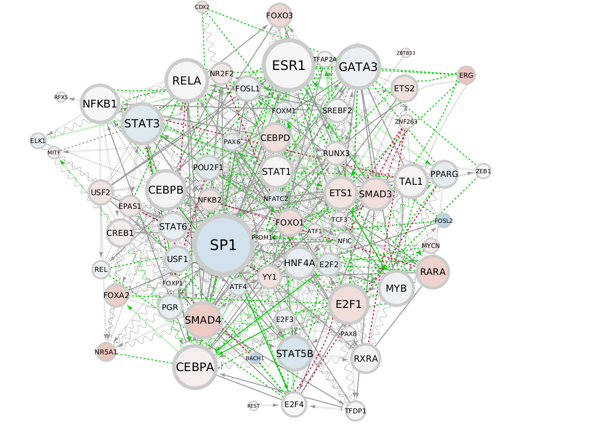

Back to [PhD Project](https://alexishucteau.github.io/PhD_project/)

[Source code](https://alexishucteau.github.io/PhD_project/Analysis/source_code/HL60_MOLM14_RNAseq_code.R)

```{r, include = F}
library(hugene20sttranscriptcluster.db)
library(oligo)
library(dplyr)
library(FactoMineR)
library(factoextra)
library(ggsignif)
library(viper)
library(dorothea)
library(data.table)
library(stringr)
library(igraph)

load("source_code/Cell_lines _analysis.RData")
```


# Analysis of HL60 MOLM14 IDHm cell lines +/- IDHi

# PCA analysis

```{r}
plot.PCA(PCA_analysis)
fviz_eig(PCA_analysis, addlabels = T)
```

# TF analysis

## HL60_Mut_IDHi_vs_no_treat

```{r HL60_Mut_IDHi_vs_no_treat}
plot(HL60_Mut_IDHi_vs_no_treat$mrs)
```

## HL60_Mut_vs_HL60_WT

```{r HL60_Mut_vs_HL60_WT}
plot(HL60_Mut_vs_HL60_WT$mrs)
```

## MOLM14_Mut_IDHi_vs_no_treat

```{r MOLM14_Mut_IDHi_vs_no_treat}
plot(MOLM14_Mut_IDHi_vs_no_treat$mrs)
```


# RELA and MYC expression in cell lines

## RELA in HL60 +/- IDHi Expression

```{r RELA in HL60 +/- IDHi Expression}
Make_gene_expr_boxplots(Transcriptomes, ID_RELA, "RELA", "HL60.Mut.AGI5198", "HL60_IDHi", "HL60.Mut.DMF", "HL60_DMF", Phenotype)
```

## MYC in HL60 +/- IDHi  Expression

```{r MYC in HL60 +/- IDHi  Expression}
Make_gene_expr_boxplots(Transcriptomes, ID_MYC, "MYC", "HL60.Mut.AGI5198", "HL60_IDHi", "HL60.Mut.DMF", "HL60_DMF", Phenotype)
```

## RELA in HL60 +/- IDHm  Expression

```{r RELA in HL60 +/- IDHm  Expression}
Make_gene_expr_boxplots(Transcriptomes, ID_RELA, "RELA", "HL60.Mut.None", "HL60_Mut", "HL60.WT.None", "HL60_WT", Phenotype)
```

## MYC in HL60 +/- IDHm  Expression

```{r MYC in HL60 +/- IDHm  Expression}
Make_gene_expr_boxplots(Transcriptomes, ID_MYC, "MYC", "HL60.Mut.None", "HL60_Mut", "HL60.WT.None", "HL60_WT", Phenotype)
```

## RELA in MOLM14 +/- IDHi  Expression

```{r RELA in MOLM14 +/- IDHi  Expression}
Make_gene_expr_boxplots(Transcriptomes, ID_RELA, "RELA", "MOLM14.Mut.AGI5198", "MOLM14_IDHi", "MOLM14.Mut.DMF", "MOLM14_DMF", Phenotype)
```

## MYC in MOLM14 +/- IDHi  Expression

```{r MYC in MOLM14 +/- IDHi  Expression}
Make_gene_expr_boxplots(Transcriptomes, ID_MYC, "MYC", "MOLM14.Mut.AGI5198", "MOLM14_IDHi", "MOLM14.Mut.DMF", "MOLM14_DMF", Phenotype)
```

# Network signatures

## HL60 IDHm + IDHi vs HL60 IDHm + DMF

 

## HL60 IDHm vs HL60 IDHwt 


## MOLM14 IDHm + IDHi vs MOLM14 IDHm + DMF


