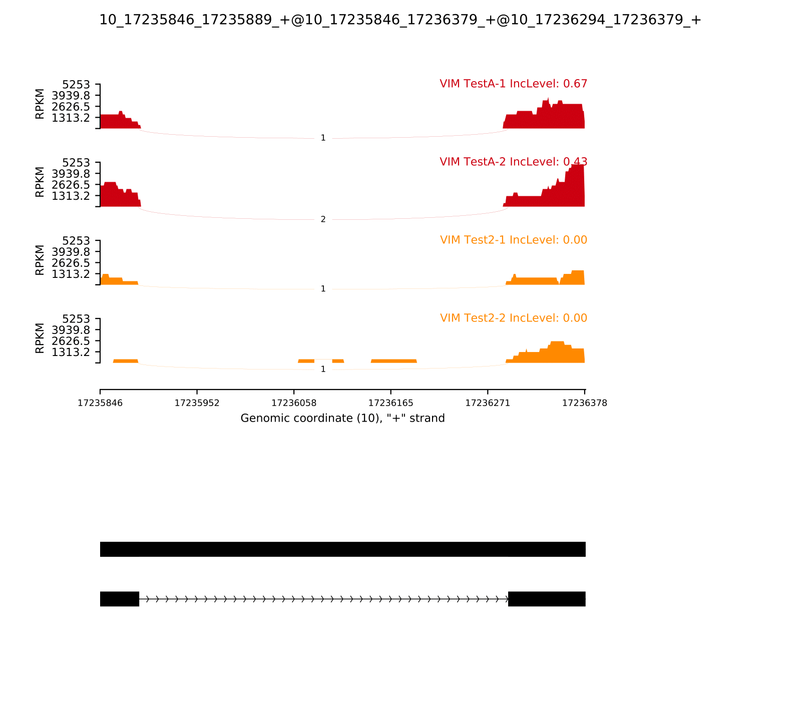

# rMATS

## Notes about the paper

> New statistical model and computer program designed for detection of differential alternative splicing from replicate RNA-seq data.

> sensitive to outliers

## How to run rMATS code?

Download gitrepo: https://github.com/Xinglab/rmats-turbo/releases/tag/v4.1.1

Install it from the rmats folder and run:

```
./build_rmats
```

The test script that creates a conda environment doesn't work but the main script works

Need fastq or bam files (paired or not), a gtf annotation file and a STAR binary indices containing the SA file (if using fastq)

```
python ../../rmats_turbo_v4_1_1/rmats.py --b1 bam1.txt --b2 bam2.txt --gtf ~/Annotation_file_gtf/gencode.v38.annotation.gtf -t paired --readLength 50 --nthread 8 --od output/ --tmp tmp/
```

An example of result:

| EventType | TotalEventsJC | TotalEventsJCEC | SignificantEventsJC | SigEventsJCSample1HigherInclusion | SigEventsJCSample2HigherInclusion | SignificantEventsJCEC | SigEventsJCECSample1HigherInclusion | SigEventsJCECSample2HigherInclusion |
 | ---- | ---- | ---- | ---- | ---- | ---- | ---- | ---- | ---- |
 | SE | 36 | 64 | 0 | 0 | 0 | 1 | 1 | 0 |
 | A5SS | 19 | 23 | 0 | 0 | 0 | 0 | 0 | 0 |
 | A3SS | 24 | 30 | 0 | 0 | 0	| 1	| 0	| 1 |
 | MXE	| 10	| 46	| 0	| 0	| 0	| 0	| 0	| 0 |
 | RI	| 76	| 102	| 5	| 4	| 1	| 4	| 1	| 3 |


SE = skipped exon  
MXE = mutually exclusive exons  
A3SS = alternative 3' splice site  
A5SS = alternative 5' splice site  
RI = retained intron

# Rmatsashimiplot

Rmatsashimiplot is a git repo that permits to create sashimiplot of the result of rmats

## Installation of rmats2sashimiplot

Download the [git repo](https://github.com/Xinglab/rmats2sashimiplot)

If using python3, you need to convert python2 script to pyton3 by running:
```
./2to3.sh -W
```
Then install it
```
python ./setup.py install
```

## Example

It need bam/sam files, the coordinates to focus or the row lines of a specific event.

RI.MATS.JC_selected.txt example focusing on VIM gene:

| ID | GeneID | geneSymbol | chr | strand | riExonStart_0base | riExonEnd | upstreamES | upstreamEE | downstreamES | downstreamEE | ID | IJC_SAMPLE_1 | SJC_SAMPLE_1 | IJC_SAMPLE_2 | SJC_SAMPLE_2 | IncFormLen | SkipFormLen | PValue | FDR | IncLevel1 | IncLevel2 | IncLevelDifference |
| ---- | ---- | ---- | ---- | ---- | ---- | ---- | ---- | ---- | ---- | ---- | ---- | ---- | ---- | ---- | ---- | ---- | ---- | ---- | ---- | ---- | ---- | ---- |
| 3497 | ENSG00000026025.16 | VIM | chr10 | + | 17235168 | 17236379 | 17235168 | 17235389 | 17235845 | 17236379 | 3497 | 1,3 | 3,4 | 0,0 | 2,0 | 98 | 49 | 1 | 1 | 0.143,0.273 | 0.0,NA | 0.208 |
| 3498 | ENSG00000026025.16 | VIM | chr10 | + | 17235845 | 17236379 | 17235845 | 17235889 | 17236293 | 17236379 | 3498 | 4,3 | 1,2 | 0,0 | 1,1 | 98 | 49 | 5.36756132241E-06 | 0.000407934660503 | 0.667,0.429 | 0.0,0.0 | 0.548 |

Example of command:
```
rmats2sashimiplot --b1 231ESRP.25K.rep-1.bam,231ESRP.25K.rep-2.bam --b2 231EV.25K.rep-1.bam,231EV.25K.rep-2.bam -t RI --l1 TestA --l2 Test2 -o output2/ -e output/RI.MATS.JC_selected.txt
```

The output is:


