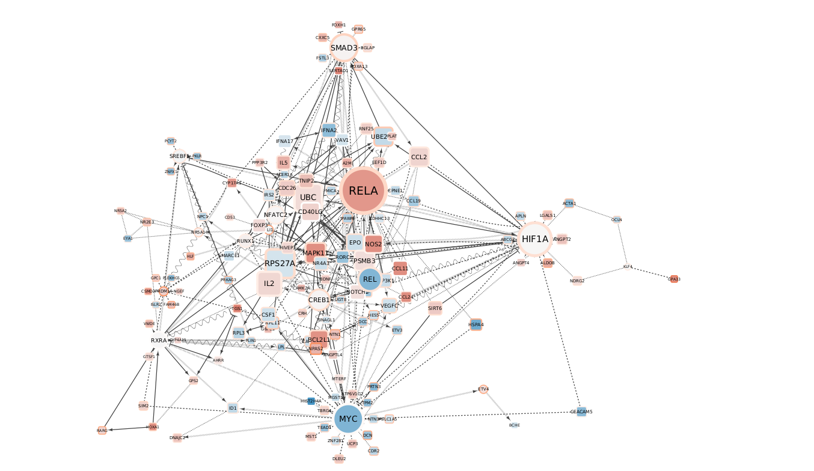
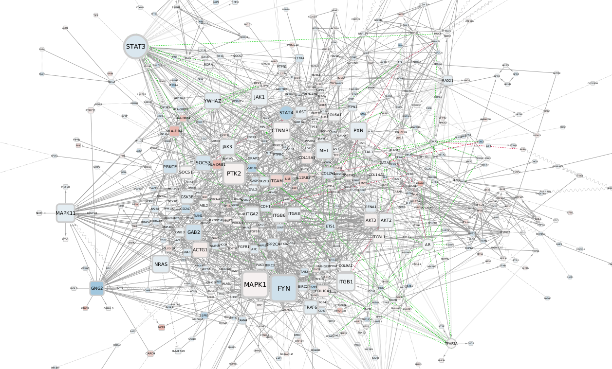

Back to [PhD Project](https://alexishucteau.github.io/PhD_project/)

[Cell lines analysis](https://alexishucteau.github.io/PhD_project/Analysis/HL60_MOLM14_RNAseq_analysis)

[Source code](https://alexishucteau.github.io/PhD_project/Analysis/source_code/Patients_samples_Koichi_analysis_code.R)

[Source code](https://alexishucteau.github.io/PhD_project/Analysis/source_code/Patients_samples_Verhaak_analysis_code.R)


```{r, include = F}
library(FactoMineR)
library(factoextra)
library(viper)
library(dplyr)

load("~/DATA/Patients_data.RData")
```


# Analysis of Patients samples Koichi's dataset

# PCA analysis

## Koichi's dataset

```{r PCA plots}
plot.PCA(PCA_rnaseq)
fviz_eig(PCA_rnaseq, addlabels = T)
```

## Verhaak's dataset

```{r}
plot.PCA(PCA_Verhaak)
fviz_eig(PCA_Verhaak, addlabels = T)
```


# TF analysis

## NR vs R IDHi

```{r TF mviper plots}
plot(R_NR_msviper$mrs)
```


## High OS vs Low OS

```{r}
plot(High_OS_vs_Low_OS_msviper$mrs)
```

# Eigen centrality analysis

## NR vs R

```{r}
Do_cool_scatterplot(NR_R_network$features, "NR vs R")
```

## High OS vs Low OS

```{r}
Do_cool_scatterplot(High_OS_vs_Low_OS_network$features, "High OS versus Low OS")
```

# RELA and MYC expression Patients samples

## RELA in NR vs R Expression

```{r}
Make_gene_expr_boxplots(RNAseq, "RELA", "NR.B", "Non_responder", "R.B", "Good_responder", Factor_R_OR_NR_B)
```

## MYC in NR vs R Expression

```{r}
Make_gene_expr_boxplots(RNAseq, "MYC", "NR.B", "Non_responder", "R.B", "Good_responder", Factor_R_OR_NR_B)
```

## RELA in High OS vs Low OS

```{r}
Make_gene_expr_boxplots(Verhaak_norm_data_SYMBOL, "RELA", "High_OS", "High_OS", "Low_OS", "Low_OS", OS)
```

## MYC in High OS vs Low OS

```{r}
Make_gene_expr_boxplots(Verhaak_norm_data_SYMBOL, "MYC", "High_OS", "High_OS", "Low_OS", "Low_OS", OS)
```


# Network signatures

## NR vs R




## High OS vs Low OS


