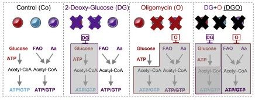
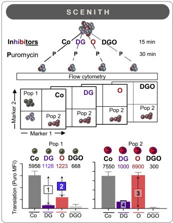
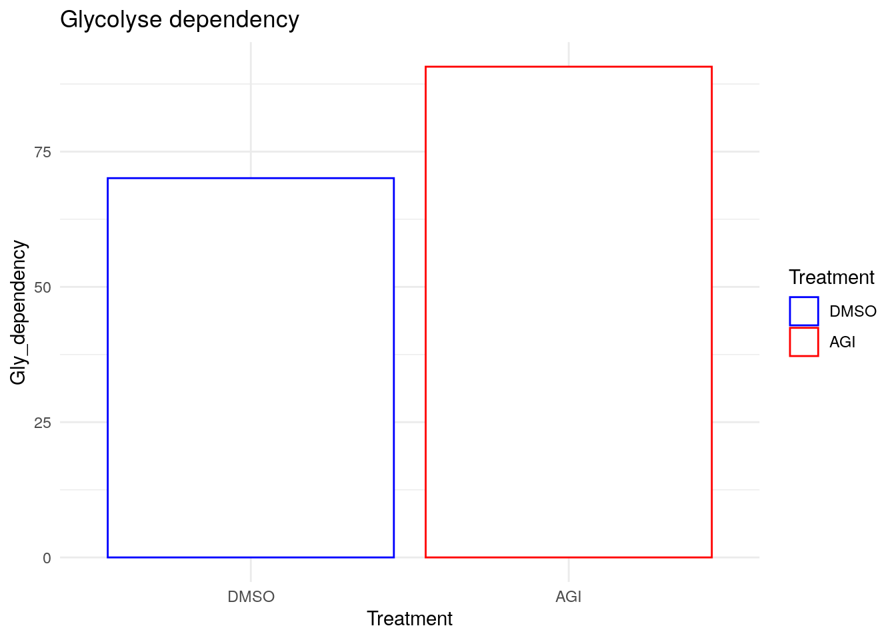
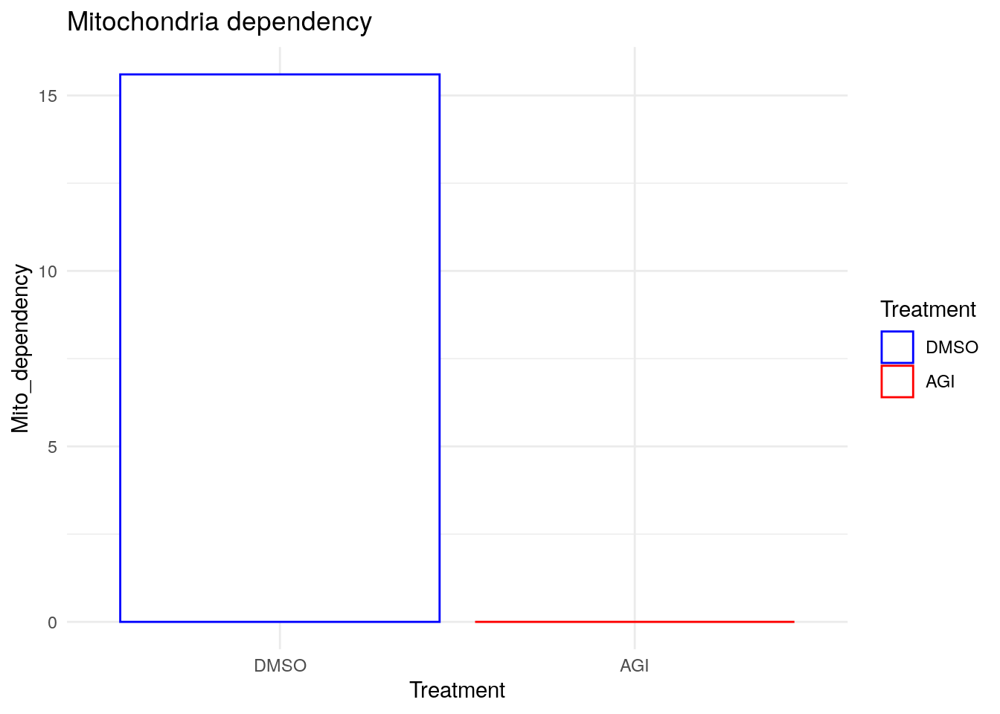
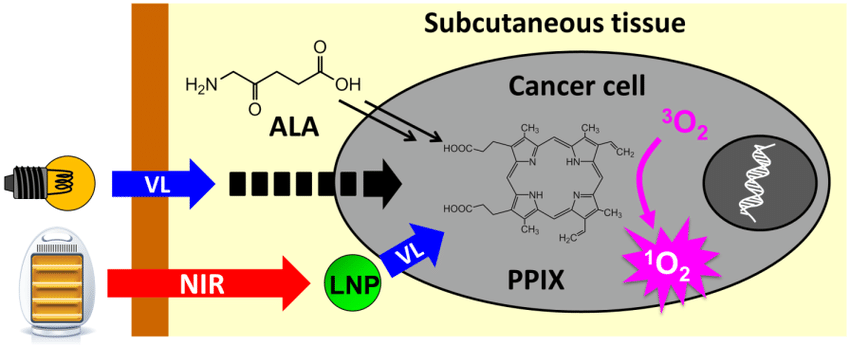
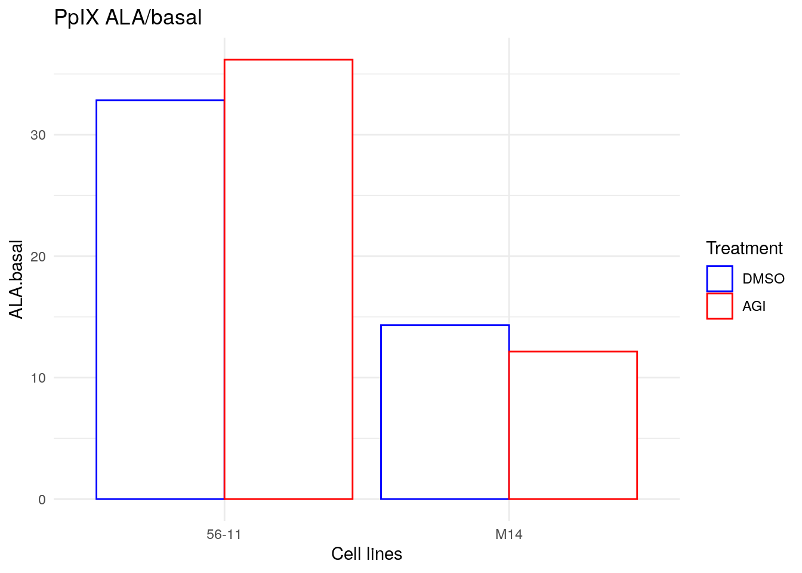
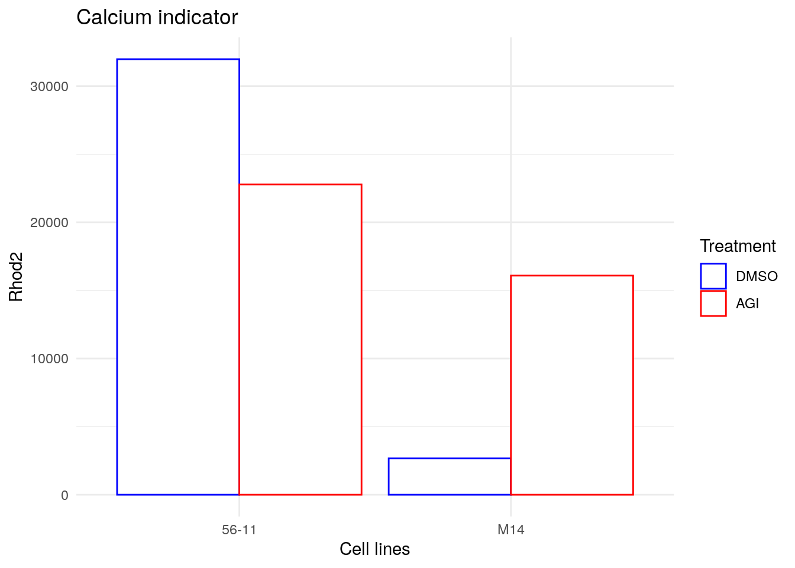

# 56-11 and M14 R132 +/- AGI

<!-- * [Scenith](#scenith-principe)
* [ATP Principe](#atp-principe)
* [PpIX principe](#ppix-principe)
* [RPA principe](#rpa-principe)
* [Immunophenotypage/differentiation principe](#immuno-principe)
* [Rhod2 principe](#rhod2-principe)
* [ARN and protein principe](#arn-principe) -->
* [Scenith](#scenith)
  * [Results on scenith](#scenith-results)
* [ATP](#atp)
* [PpIX](#ppix)
<!-- * [RPA?](#rpa) -->
* [Immunophenotypage and differentiation](#immuno)
* [Rhod2](#rhod2)
  * [Results on Rhod2](#rhod2-results)

<!-- # Scenith Principe {#scenith}
# ATP Principe {#atp-principe}
# PpIX principe {#ppix-principe}
# RPA principe {#rpa-principe}
# Immunophenotypage/differentiation principe {#immuno-principe}
# Rhod2 principe {#rhod2-principe}
# ARN and protein principe {#arn-principe} -->

# Scenith {#scenith}

[**Single-cell energetic metabolism by profiling translation inhibition**](https://www-sciencedirect-com.proxy.insermbiblio.inist.fr/science/article/pii/S1550413120306021?via%3Dihub)

Scenith permits to determine the metabolism pathway dependency of cells by using different inhibitors like:
* DG for 2-deoxy-d-glucose that inhibits glycolyse
* O for Oligomycin A that inhibits the ATP synthase (Complex V) of the OxPHOS.
* DGO for the combination of the two inhibitors

## Results {#scenith-results}

The GFP from the cell line 56-11 makes this analysis impossible for this cell line so only Molm14 was analyzed.

### Pathways dependencies

The production of the ATP in MOLM14 R132 is 70.1% glycolyse dependent.  
But is going higher after the treatment with AGI120 to 90.7%.

The production of the ATP in MOLM14 R132 is 15% OxPHOS dependent but goes to 0% after the treatment with AGI120.

--> Look at biblio what could we find about inhibitor IDHm and metabolism dependency
--> Lucille paper.

# ATP {#atp}

To investigate the OxPHOS state of cells, the amount of ATP is a good marker. In brain, 90% of the ATP is produced by OxPHOS so a higher production of ATP is linked to an high OxPHOS state.

# PpIX {#ppix}

PpIX for Protoporphyrin IX serves as the substrate for ferrochelatase, the final enzyme in heme biosynthesis, and its homeostasis is tighly regulates during heme synthesis.  
One of the project of the team and more particularly Estelle's project is looking at Iron and the synthesis of heme. Its synthesis is Alamine dependent.

## Results {#ppix-results}

PpIX shows higher concentration in 56-11 than in Molm14. Inhibitors do not show modifications in PpIX concentration in 56-11 neither in Molm14.

As PpIX synthesis is Alamine dependent, the addition of Alamine in the middle increase the concentration if PpIX in both cell lines. IDHi shows different impact for the two cell lines with an increased ratio for 56-11 but a decreased ratio for Molm14.

<!-- # RPA {#rpa} -->

# Immunophenotypage and differentiation? {#immuno}

## CD11b

CD11b or ITGAM for Integrin alpha M is a cluster of differentiation molecule 11B used for identification of macrophages and microglia.

Molm14 show higher makers of CD11b than 56-11 but IDHi seems to increase the presence of the marker in both cell lines.

## CD14

CD14 for cluster of differentiation 14 is also used for macrophages identification. CD14+ monocytes can differentiate into a host of different cells, including dendritic cells, a differentiation pathway encouraged by cytokines, including GM-CSF and IL-4.

The two cell lines show the same level of CD14 and a relative increased after IDHi treatments.

## CD15

CD15 or Sialyl Lewis (sLeX) plays a vital role in cell-to-cell recognition processes. It is also constitutively expressed on granulocytes and monocytes and mediates inflammatory extravasation of these cells.

The two cell lines show the same level of CD15 before treatment but 56-11 shows a important increased by IDHi treatment.

# Why looking at Rhod2? {#rhod2}

Rhod2 can be used as a mitochondrial calcium indicator. Rhod2 hibit large fluorescence intensity increases upon binding Ca2+ (>100-fold).

## Results {#rhod2-results}

At baseline, 56-11 exhibits a higher rate of calcium compared to Molm14. The calcium goes down after IDHi treatment in 56-11 but goes up in Molm14.

--> Look at biblio what could we find about inhibitor IDHm and calcium
--> Lucille paper.

# Resume

This table resume the preliminary results that may show the differences between the two cell lines 56-11 and molm14 in the response to IDHi.  
Our analysis showed that IDHi increases CD15 in molm14, glycolysis dependency, calcium in mitochondria but a decreased of mitochondrial calcium in 56-11.  
Previous results showed that IDHi increases OCR and PGC1a protein expression in 56-1 and a decreased in PGC1a and an increased Venetoclax sensitivity of molm14 after IDHi.

Our results on CD15, Rhod2 and metabolism dependency have to be done again to be confirmed and CD38 will also be measured additionally.

The RELA, MYC, BCL2 and PGC1a will be measured in term of RNA and protein levels.  
