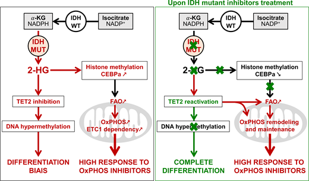

# Mitochondrial metabolism supports resistance to IDH mutant inhibitors in acute myeloid leukemia

# Abstract

Manipulating glycolysis, glutaminolysis, fatty acid B-oxidation or OxPHOS markedly reduces cell growth in vitro and in vivo and sensitizes AML cells to drugs.  
Metabolism flexibility makes the cancer cells able to adapt and be resistant.  
IDH1 and IDH2 are two metabolic enzymes which are found mutated in > 15% of AML patients.  

IDHm are early events and conserved at relapse.
IDHm leads to accumulation of 2HG.
IDHmi promotes differentiation and reduce DNA and histone methylation levels as well as 2HG concentration.  
But several mechanisms of resistance to these targeted therapies have already been identified.  
NR displayed significant decrease in the amount of 2HG suggesting that alternative mechanisms may compensate for 2HG to drive tumor progression.  
Clonal heterogeneity, secon-site mutation or multiple pathways involves in signaling (RAS especially) have been shown to be responsible for relapse in patients treated with IDHi.  

Targeting IDHm activity is not sufficient to achieve a durable clinical response in most patients.  

IDHwt roles in cell metabolism:
* Krebs cycle
* OxPHOS_dependency
* Mitochondrial redox
* anabolism incuding lipid biosynthesis

IDHm cells exhibit some metabolic specificities related to redox homeostasis through NAD(P)+ availability.  
Any study have shown how metabolic changes elicited by IDHm modulate cell proliferation and drug resistance or impact therapeutic response in AML.  
We therefore hypothesized that mitochondrial OxPHOS plays a crucial role in IDHi biology and in the response of AML patients with IDHm to IDHi.  

Mitochondrial oxidative metabolism is enhanced in IDHm cells in vitro and in vivo through the increase in methylation-driven CEBPa-induced FAO. IDHi reduce 2HG and CEBPa methylation but failed to reverse FAO and OxPHOS due to the enhanced activation of PGC1a.

# Results
