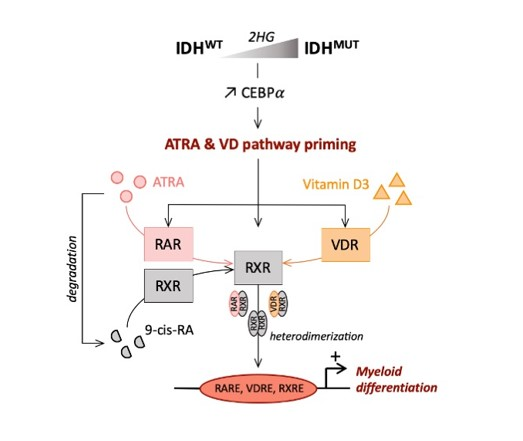

# Introduction

* [AML](#aml)
* [IDH](#IDH)
  * Where is IDHm in AML cases?
  * Effects of IDHm in AML?
    * Transcriptomic
    * DNA Methylation
    * Histone modifications
* [IDHm inhibitor](#IDHmi)
  * What are the actual knowledge about the inhibitor?
* [IDHm inhibitor resistance](#idhmi-res)
  * About the resistance
* [TF activities](#tfs)
  * Different methods to infer it
    * Dorothea
    * i-cis Targets
  * How to make it more precise?
    * ATAC-seq
* [Networks](#networks)
  * Inferring regulatory network?
  * Different metrics
* [DNA methylation](#dna-meth)
  * What is it?
  * What are there effects?
  * How to have access to those modifications?
* [Chromatin structure](#chromatin-structure)
  * Differents states of the chromatin
  * When is it modified?
  * How?
  * How to have access to that information?
* [Single cell](#single-cell)
  * What are single cell analysis?
  * To study what?
* [Differentiation](#diff)
  * What is differentiation?
  * Why is it involved in AML?
  * How?
  * Why is it involved in IDHm AML?
  * How?
* [Dedifferentiation](#dediff)
  * What is differentiation?
  * Why is it involved in AML?
  * How?
  * Why is it involved in IDHm AML?
  * How?
* [Stress response](#Stress)
  * What is a cellular Stress?
  * What is a Stress Response?
  * How is it connected to AML?
  * How is it connected to IDHm AML?
  * Is it connected to the resistance?

# AML {#aml}

# IDH {#IDHm}

[Mitochondrial metabolism supports resistance to IDH mutant inhibitors in acute myeloid leukemia](https://rupress.org/jem/article/218/5/e20200924/211914/Mitochondrial-metabolism-supports-resistance-to)

# IDHm inhibitor {#IDHmi}

# IDHm inhibitor resistance {#idhmi-res}

## Résistance Intrinsèque

## Résistance acquise

[Mitochondrial metabolism supports resistance to IDH mutant inhibitors in acute myeloid leukemia](https://rupress.org/jem/article/218/5/e20200924/211914/Mitochondrial-metabolism-supports-resistance-to) décrit un métabolisme mmitochondrial oxidatif exacerbé. Il serait dû l'hyperméthylation d'histones

# TF activities {#tfs}

# Networks {#networks}

# DNA methylation {#dna-meth}

# Chromatin structure {#chromatin-structure}

# Single cell {#single-cell}

# Differentiation {#diff}

# Dedifferentiation {#dediff}

# Stress response {#Stress}

The main topic of the thesis is in silico, epigenomic and functional investigations of resistance to IDH inhibitors in acute myeloid leukemia.

Acute myeloid leukemia (AML) is a deadly disease associated with poor outcomes. The median age of patients harbouring AML is around 70 years old and the prognoses decline with the age. For decades, intensive chemotherapies were the only treatments available. The combination of Cytarabine (AraC) and daunorubicin shows good results but not all the patients are eligible for intensive therapy. Hypomethylating agents are the current alternative therapy but only 16% of patients achieve complete remission with a median overall survival about 21 months.

Novel therapies have been accepted like the combinaison Venetoclax + Azacitidine to avoid intensive therapy but there is still a crucial need of novel therapies to overcome the relapses and refractory diseases. Although 60–80% of AML adult patients achieve complete remission after the first induction chemotherapy, roughly 20% will show primary refractory disease and more than 50% will relapse.

Specific mutations have been found to induce the relapses like FLT3-ITD, IDH1/2 or the presence of CD33 and inhibitors are already studied but there are still resistances to that therapies. IDH1 and IDH2 are metabolic genes that convert isocitrate into alpha ketoglutarate (aKG), a metabolite that is itself converted into 2 hydroxyglutarate (2HG) by the mutated IDH protein. The abnormal production of the oncometabolite 2-hydroxyglutarate (2-HG) induces epigenetic and transcriptional reprogramming, differentiation bias, and susceptibility to mitochondrial inhibitors in cancer cells.

It's important to notice that heterozygotie of IDHm is mandatory for the production of 2HG and a good balance of IDHwt protein and IDHm protein. [The implications of IDH mutations for cancer development and therapy](https://www-nature-com.proxy.insermbiblio.inist.fr/articles/s41571-021-00521-0)  

In a recent study, it have been shown that patients with AML harboring an IDH mutation displayed an enhanced mitochondrial oxidative metabolism through the methylation-driven CEBPa induction but inhibition of the mutation, despite the reduction of CEBPa enhancement, failed to reverse the mitochondrial oxidative metabolism through an AKT/PPARGg pathway (ref: [Mitochondrial metabolism supports resistance to IDH mutant inhibitors in acute myeloid leukemia](https://pubmed.ncbi.nlm.nih.gov/33760042/)).

Another study from our group showed that the presence of the mutation induces Vitamin D receptor related programs priming the AML cells to differentiate with pharmacological doses of ATRA or/and VD comforting the relevance of metabolic pathway in the mutation (ref: [Activation of Vitamin D Receptor Pathway Enhances Differentiating Capacity in Acute Myeloid Leukemia with Isocitrate Dehydrogenase Mutations](https://www.preprints.org/manuscript/202108.0529/v1)).

Another study focusing on the inhibition of IDH suggests that stemness is associated with primary resistance and selection of mutations in RUNX1/CEBPA or RAS/RTX pathway genes are the driver of acquired resistance (ref: [Leukemia stemness and co-occurring mutations drive resistance to IDH inhibitors in acute myeloid leukemia](https://www.nature.com/articles/s41467-021-22874-x)).

The IDH mutations are also studied in other cancers like in glioma. Interestingly, despite the induction of 2HG like in AML, prognosis of IDHm glioma are better than IDHwt glioma. In this study [Epigenetic encoding, heritability and plasticity of glioma transcriptional cell states](https://www-nature-com.proxy.insermbiblio.inist.fr/articles/s41588-021-00927-7), they analysed scRNA-seq but also scDNAme-seq and highlight some plasticity of the cell states due to IDHmutation.

About DNA methylation in IDHm AML samples, Elisabeth R. Wilson et al. in [Genome-wide analysis of focal DNA hypermethylation in IDH-mutant AML samples](https://www.biorxiv.org/content/10.1101/2021.03.03.433799v2.full) analyzed WGBS DNA methylation data of IDHm/wt and CD34+ cells and confirmed the importance of non-CpG island hypermethylation and more specifically of enhancer methylation. They also found an hypermethylation of an enhancer of MYC and ETV6 despite their expression changed.

To investigate the resistance, we analyzed transcriptomes of different cohorts of patients. TCGA and Verhaak datasets have been used to compare the patients samples harbouring IDH mutation to patients samples without the mutation. Verhaak data have been used to look at primary resistance through the analysis of Overall Survival and the patient cohort from Koichi’s data have been used to investigate the acquired resistance by looking at relapsed or refractory AML behaviour after IDH inhibitor therapy.

By combining transcription factor activity, differential gene expression, functional protein-protein interaction network and network analysis, we found some transcription factor like **RELA**, **MYC**, **HIF1a**, **SMAD3** or **REL** that might be the main actor of the acquired resistance and **STAT3**/**STAT4** for the primary resistance.

In [CBFb-SMMHC Inhibition Triggers Apoptosis by disrupting MYC Chromatin Dynamics in Acute Myeloid Leukemia](https://pubmed-ncbi-nlm-nih-gov.proxy.insermbiblio.inist.fr/29958106/) they showed that a chromatin alteration of the chromosome 16 leads to the repression **MYC** by replacing the SWI/SNF TF by **RUNX1** on its enhancer.

In [Integrative Genomic Analysis of Cholangiocarcinoma Identifies Distinct IDH-Mutant Molecular Profiles](https://pubmed-ncbi-nlm-nih-gov.proxy.insermbiblio.inist.fr/28658632/) about Cholangiocarcinoma IDHm cases, they found a hypermethylation and downregulation of **ARID1A** compared to IDHwt. ARID1A is a member of the SWI/SNF family and might be link to **MYC** aswell.

In [A Myc enhancer cluster regulates normal and leukaemic haematopoietic stem cell hierarchies](https://www-nature-com.proxy.insermbiblio.inist.fr/articles/nature25193), they showed a BloodENhancerCluster (BENC) enhancer region located downstream of the **MYC** locus is essential for HSC function

About **RELA**, also called **NF-kB**, it has been shown that it is involved in several cellular functions in hematological malignancies, i.e. inflammation, apoptosis, cell survival, proliferation, angiogenesis, and innate and acquired immunity (ref: [NF-κB pathways in hematological malignancies](https://pubmed.ncbi.nlm.nih.gov/24419302/)).

In [The oncometabolite R-2-hydroxyglutarate activates NF-κB-dependent tumor-promoting stromal niche for acute myeloid leukemia cells](https://www-nature-com.proxy.insermbiblio.inist.fr/articles/srep32428)

But also linked to **MYC** as a **NF-kB** repressing factor (**NKRF**), shifted to the cytosplasm by a protein synthesis inhibitor **HTT**, attenuates the transactivation activity of **p65** on the **MYC** gene (ref: [Homoharringtonine deregulates MYC transcriptional expression by directly binding NF-κB repressing factor](https://www.ncbi.nlm.nih.gov/pmc/articles/PMC6369765/)).

In AML, **RELA** targets a long noncoding RNA **uc002jit.1**. Its KO impaired the stability of **PARP1**, a prtein that help DNA damage repair. Its KO also inhibit AML cells proliferation and increased the sensitivity to drugs. (ref: [The role of the novel LincRNA uc002jit.1 in NF-kB-mediated DNA damage repair in acute myeloid leukemia cells](https://www-sciencedirect-com.proxy.insermbiblio.inist.fr/science/article/pii/S0014482720302007))

The cleavage of **p65**/**RELA** by **RIP3** induces apoptosis. **RIP3** silencing in leukemia cells results in suppression of the complex regulation of the apoptosis/necroptosis switch and **NF-κB** activity. (ref: [RIP3 is downregulated in human myeloid leukemia cells and modulates apoptosis and caspase-mediated p65/RelA cleavage](https://www.ncbi.nlm.nih.gov/pmc/articles/PMC4454320/))

Stabilization of NF-κB-inducing kinase (**NIK**) suppresses AML. Stabilization of NIK-induced activation of NF-κB non-canonical signaling upregulates **Dnmt3a** and downregulates **Mef2c**, which suppresses and promotes AML development, respectively. [Stabilization of NF-κB-Inducing Kinase Suppresses MLL-AF9-Induced Acute Myeloid Leukemia](https://pubmed.ncbi.nlm.nih.gov/29320732/)

[A Myc enhancer cluster regulates normal and leukaemic haematopoietic stem cell hierarchies](https://drive.google.com/file/d/1Z0EUt4SEl1aKonIxNyraw3rbo27JNyu6/view?usp=sharing)

In [The STAT3-MYC Axis Promotes Survival of Leukemia Stem Cells by Regulating SLC1A5 and Oxidative Phosphorylation](https://www-sciencedirect-com.proxy.insermbiblio.inist.fr/science/article/pii/S0006497121016049?via%3Dihub), they characterised that STAT3 regulates amino acid influx and glutaminolysis in leukemia stem cells by promoting expression of MYC and SLC1A5 and that Depletion of glutamine and its downstream metabolites leads to a decrease in OXPHOS activity in LSCs resulting in cell death.

In a context of chromatin aspect, the paper [Cooperative binding between distant transcription factors is a hallmark of active enhancers](https://pubmed-ncbi-nlm-nih-gov.proxy.insermbiblio.inist.fr/33705711/) uncovers transcription factor binding and cooperativity at functional enhancer genome-wide in Drosophila cells. They showed that cooperativity between distanced regions imply the absence of protein-protein interaction but is driven by chromatin dynamics. The CpGs methylation is not studied here but used as experiment to find free chromatin regions.

It's important to define one of the topic of the thesis that is stress.

In the paper [Integrated Stress Response Activity Marks Stem Cells in Normal Hematopoiesis and Leukemia](https://www-sciencedirect-com.proxy.insermbiblio.inist.fr/science/article/pii/S2211124718315973?via%3Dihub), they show that AML displayed **eIF2** scarcity promoting **ATF4** upregulation that activates ISR promoting cell survival.

Mark S. Williams et al., in [A stress-responsive enhancer induces dynamic drug resistance in acute myeloid leukemia](https://www.jci.org/articles/view/130809) they analyzed an integrated stress response-like transcriptional program that induces ABCB1 through remodeling and activation of an ATF4-bound, stress-responsive enhancer.

*to be continued*

# Methods
