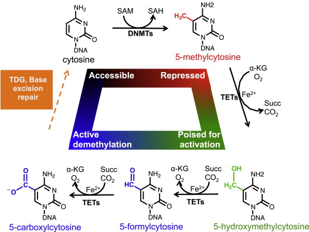
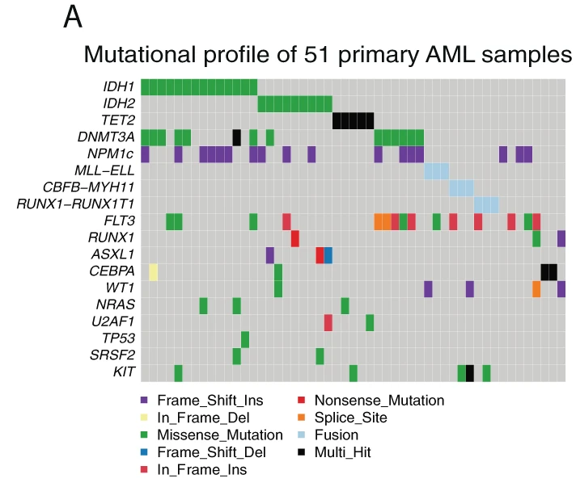
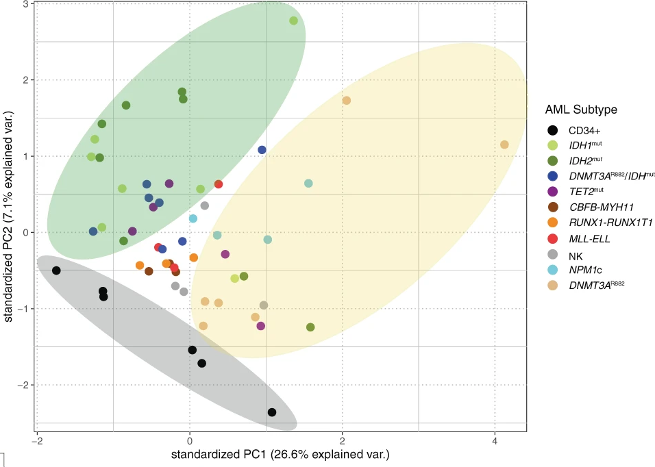

# Focal disruption of DNA methylation dynamics at enhancers in IDH-mutant AML cells

## Astract

Dans les LAM IDH1 ou IDH2 mutant, on retrouve une hyperméthylation de l'ADN. En analysant des données de séquençage du génome entier par méthode de conversion au bisulfite, ils ont trouvé environ 4000 régions local qui était uniquement hyperméthylés dans les LAM IDHm comparé aux cellules normales CD34+. Les cellules CD34+ étant des cellules souches hématopoiétique. Ces régions semblent modestement hyperméthylées chez les TET2 mutés et leur niveau de 5-hydroxymethylation diminué dans les TET2 et IDH mutants.  
La 5-hydroxymethylation correspond à une modification épigénétique d'une base nucléique via méthylation puis hydroxylation.   
  
Comme la figure le montre, les TETs convertissent les 5-methylcytosine en ce 5-hydroxymethylcytosine qui sera ensuite oxydé en 5-formylcytosine. Un niveau de 5-hydroxymethylcytosine faible représente une absence d'activité des protéines TETs.  
Cette diminution reflète donc une inhibition des TETs par la mutation des IDHs mais aussi de celle des TETs.   
Les régions retrouvées hyperméthylés dans les IDHm sont faiblement méthylés dans les cellules CD34+. Comme l'absence de TETs engendre une méthylation et qu'avec les TETs l'ADN n'est pas méthylé, cela implique que ces régions de l'ADN sont le siège d'une méthylation/démethylation active. Lorsque le gène impliqué dans la méthylation DNMTs est muté, l'ADN est significativement moins methylé. Cela implique les DNMTs dans ce phénotype hyperméthylés des IDHm.  
Les hypermethylations retrouvés dans les LAM IDHm semblent associées à des enhancers de gènes impliqués dans l'hématopoiétiese normal et dans les LAM comme MYC et ETV6.  
Pour résumer, les mutations d'IDH dans les LAM semblent créer un déséquilibre dans la balance methylation/déméthylation qui a pour conséquences des dérégulation d'enhancer de gènes impliqués dans la pathogénèse des LAM.

## Results

### Les échantillons de LAM IDH1/2 mutés sont hyperméthylés dans des régions faiblement méthylés chez les cellules souches CD34+.

Ce résultat provient d'une analyse de l'analyse de 51 échantillons primaires de LAM dont 15 sont IDHm (7 IDH1 et 8 IDH2) et de 6 échantillons sain de cellules primaires CD34+.  
  
Basé sur la méthylation de ces échantillons, ils ont retrouvé des clusters dépendant des mutations IDH/TET et DNMTs.  

