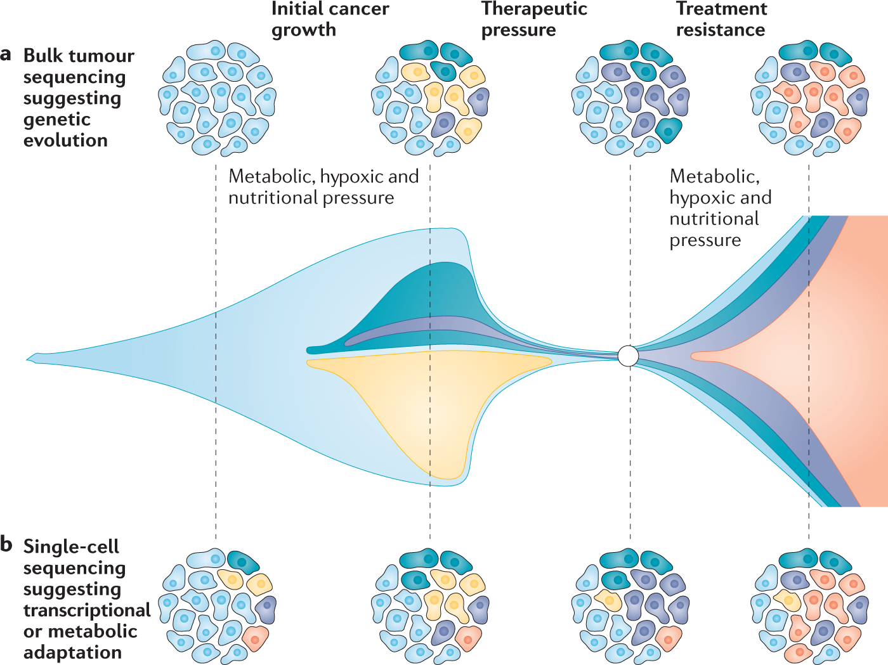

# **Non-genetic mechanisms of therapeutic resistance in cancer**

*Jean-Christoph Marine, Sarah-Jane Dawson & Mark A. Dawson*

Cancer relapse from minimal residual disease (MRD)
* clonal evolution (genetic mechanisms) -> **Known**
* Non-genetic mechanisms -> **Remain largely unknown**

## Therapeutic resistance in cancer

Resistance is:

| Primary | Secondary |
| ---- | ---- |
| Intrinsic | Acquired |
| lack of clinical response after therapy | local or distant reccurence of the malignancy after therapy |

Secondary resistance:
* Genetic evolution
