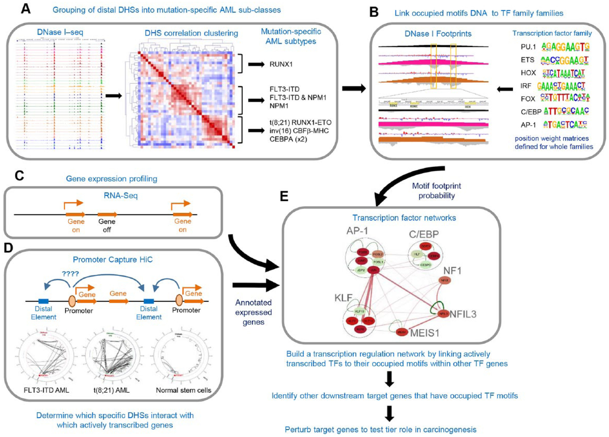

# Rewiring of the Transcription Factor Network in Acute Myeloid Leukemia

TF family = TF having similar DNA binding domains  
Multiple TF cooperation + chromatin modifiers generate open chromatin regions

Mapping DNase I hypersensitive sites (DHS) --> open chromatine --> potential cis-regulatory elements
Sequencing of DHS --> binding motifs --> TF family  
RNAseq for expression of TF family -> TF from TF family found that may be the one bound to this DHS  
PCHiC --> determine which specific DHS interact with which specific actively transcribed genes  
--> Regulatory network

