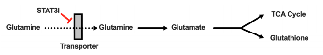
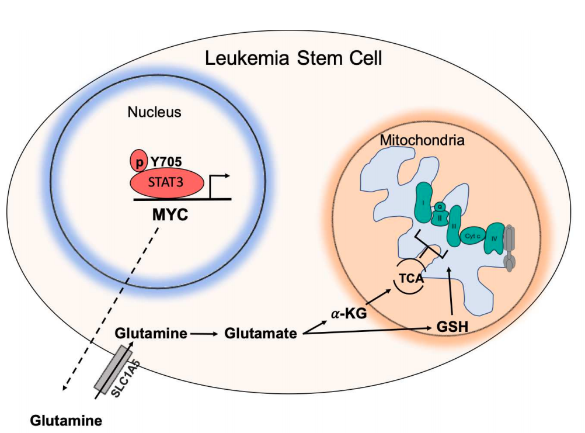

# The STAT3 MYC Axis Promotes Survival of Leukemia Stem Cells by Regulating SLC1A5 and Oxidative Phosphorylation

## *Abstract*

LSC preferential reliance on OXPHOS for energy metabolism ans survival

> * STAT3 mediates OXPHOS in LSCs.
* STAT3 regulates AML-specific expression of MYC
* MYC controls SLC1A5 (neutral amino acid transporter)  

*Decrease* in **SLC1A5** -> *Reduction* of intracellular levels of glutamine, glutathione and multiple TCA metabolites -> *reduction* of TCA cycle -> *inhibition* OXPHOS

> STAT3 inhibition -> AML stem and progenitor cells death & spare normal Hcells.

A **STAT3**-mediated mechanism that controls energy metabolism and survival in primitive AML cells.

## *Key points*

* **STAT3** regulates amino acid influx and glutaminolysis in leukemia stem cells by
promoting expression of **MYC** and **SLC1A5**.
Depletion of glutamine and its downstream metabolites leads to a decrease in
OXPHOS activity in LSCs resulting in cell death.

## *STAT3 model*

> STAT3 is phosphorylated at Y705 which signals its localization to the nucleus to regulate the expression of several genes, including MYC. MYC, in turn, promotes expression of the amino acid transporter SLC1A5, allowing influx of glutamine into the cell and ultimately abundance of TCA cycle intermediates and GSH. TCA cycle intermediates then promote oxidative phosphorylation by ETC activity. GSH is known to promote glutathionylation of the ETC Complex II, which is important for its activity. Upon inhibition of STAT3, glutaminolysis is compromised, decreasing levels of glutamate, GSH and TCA cycle intermediates thereby decreasing OXPHOS in LSCs.
