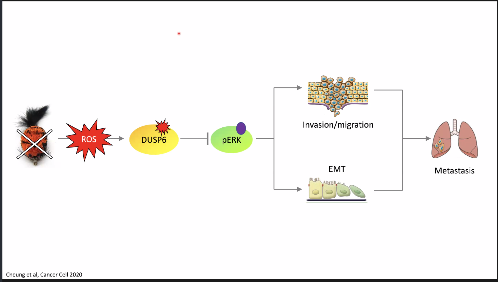
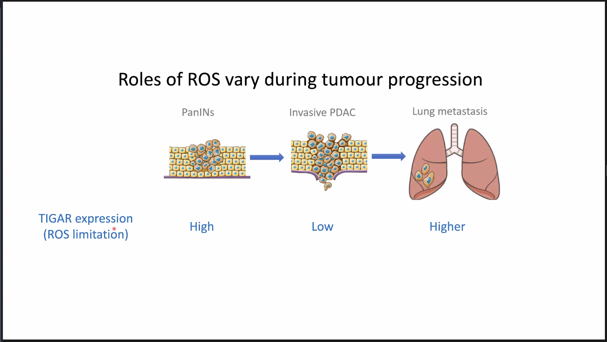
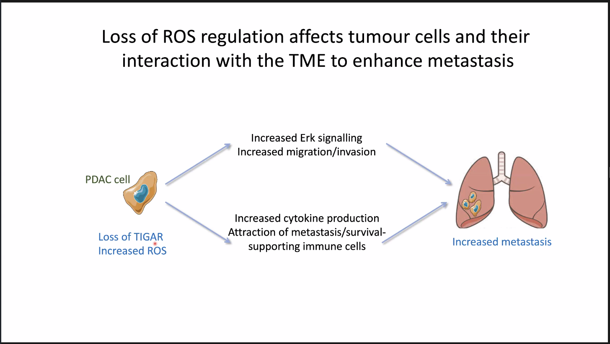

# Regulation of ROS and metastasis

## Abstract

Signaling by reactive oxygen species (ROS) is important for many aspects of normal cell behavior and can play a role in promoting cancer development. However, ROS dysregulation also results in cell death and tumor cells frequently depend on ROS controlling mechanisms for survival. ROS play an important role in modulating the interaction of the tumor cell with the surrounding microenvironment (TME), and ROS can affect the non-cancer cells differently than the tumor cells themselves. How cancers respond to ROS modulation appears to be dependent on multiple factors, including the types, levels, localization and persistence of ROS, as well as the origin, environment and stage of the tumours themselves. We have found that the expression of TIGAR, a protein with antioxidant capacity, changes dynamically during the development of pancreatic cancer in mice and humans, with high levels of TIGAR in premalignant and early-stage lesions and lower expression of TIGAR in metastasising advanced tumors. Correlating with this expression pattern we find that loss of TIGAR impedes the initial steps of tumorigenesis but drives metastasis, which can be limited by antioxidant treatment. By contrast, overexpression of TIGAR can limit the metastatic capacity of these cancer cells. The enhanced metastatic activity of TIGAR null PDAC cells reflects increased ERK activity, accompanied by the acquisition of a more mesenchymal phenotype and enhanced migration and invasion in vitro. Loss of TIGAR also impacts the interaction of cancer cells with the TME, driving a change in fibroblast and immune cell to support cancer cell dissemination.

## Slides

* Loss of TIGAR (increased ROS) extends survival in sime tumour models
  * Loss of anti-oxidant defence retards tumour development
* Loss of TIGAR in PDAC model enhances metastasis

* Tigar deletion also affects the PDAC ME (fibro infiltration)
* Increased migration of KO PDAC in the presence of fibroblast
* Altered cytokine levels in medium from TIGAR KO PDAC cells
  * aSMA
* Overexpression of TIGAR limits invasion and metastasis in mutant p53 PDAC
* Increased ROS in TIGAR deficient PDAC leads to lipid peroxidation
* TIGAR provides protection from ferroptosis
* Co-culture with macrophages protects TIGAR KO from ferroptosis

