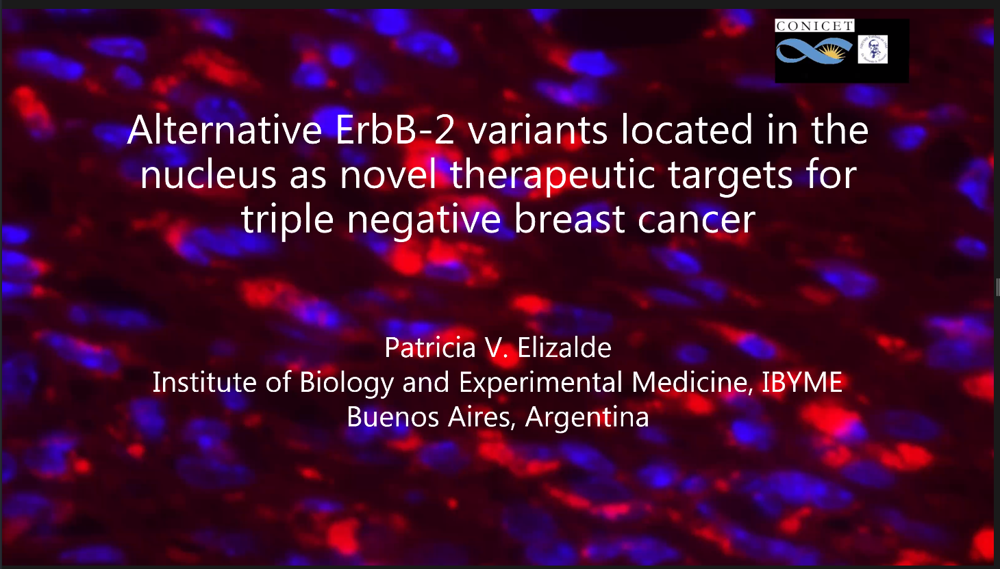
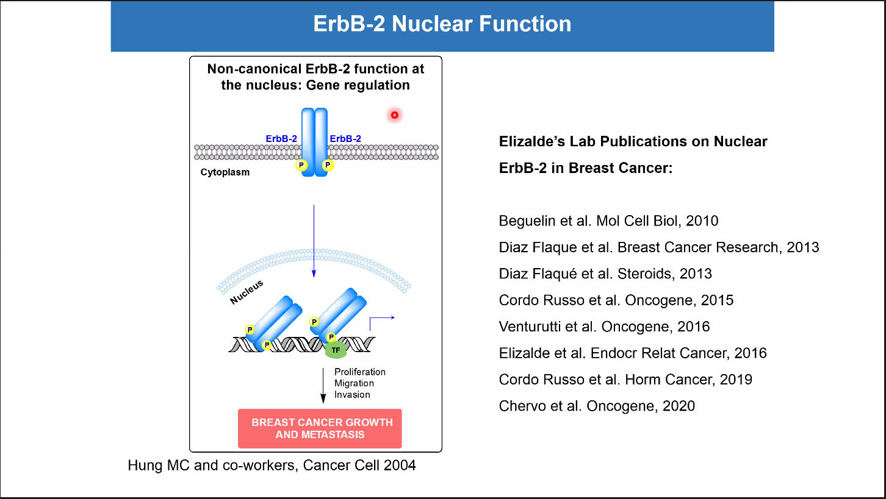

# Alternative ErbB-2 variants located in the nucleus as novel therapeutic targets for triple negative breast cancer

## Abstract

Triple negative breast cancer (TNBC) refers to tumors that do not express clinically significant levels of estrogen and progesterone receptors, and lack membrane overexpression or gene amplification of ErbB-2/HER2, a receptor tyrosine kinase. Due to TNBC heterogeneity, clinical biomarkers and targeted therapies remain elusive, so chemotherapy has been the standard of care for early and metastatic TNBC. Our present findings place ErbB-2 in an unanticipated scenario: the nucleus of TNBC (NErbB-2). Our study on ErbB-2 alternative splicing events, using a PCR-sequencing approach combined with an RNA interference strategy, revealed that TNBC cells express either the canonical (wild-type) ErbB-2, encoded by transcript variant 1, or the non-canonical ErbB-2 isoform c, encoded by alternative variant 3, or both. Silencing isoform c blocks TN cell and tumor growth, revealing NErbB-2 isoform c dominant oncogenic potential. Furthermore, we validated our findings in the clinic and observed that NErbB-2 correlates with poor prognosis in primary TN tumors, disclosing NErbB-2 as a novel biomarker for TNBC. Our discoveries highlight targeting nuclear ErbB-2 as a novel theragnostic approach for this disease.

## Slides notes

