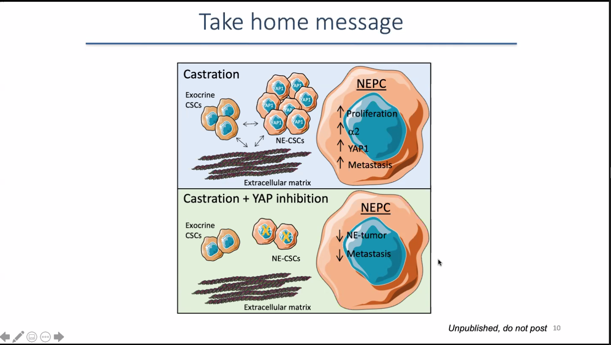

# [ST05] Castration-related remodeling of the tumor microenvironment supports signaling through integrin α2 and progression to neuroendocrine prostate cancer  

## Abstract

Neuroendocrine (NE) differentiation mostly occurs in prostate cancer (PC) patients because of castration resistance, and associates with dismal prognosis. How NEPC acquires its aggressive behavior is not fully defined. We report that in the absence of androgens, exocrine PC stem-like cells from transgenic adenocarcinoma of the mouse prostate (TRAMP) mice promoted integrin α2 up-regulation and YAP activation in NEPC stem-like cells (PNE-SCs), thus supporting their proliferation and invasive behavior. The extracellular matrix (ECM) derived from the prostate of tumor-bearing TRAMP mice and not wild type littermates also supported PNE-SCs proliferation and α2 up-regulation. While microenvironment-conditioned PNE-SCs showed in vivo metastatic behavior, pharmacologic inhibition of YAP reduced metastasis appearance and prevented the development of NEPC. These findings demonstrate the existence of a crosstalk among PCSCs and the ECM that, especially in the absence of androgens, promotes NEPC. Drugs targeting α2-YAP axis might find application in patients candidate to androgen deprivation therapy.

## Slides

* Neuroendocrine prostate cancer
* Low survival rate (7 months)
* PAC-SCs induce a2 up regulation in PNE-SCs
* integrin alpha 2
* The extracellular matrix from TRAMP mice prostate differs from the healthy counterpart
* PAC-SCs induce YAP1 up regulation in PNE-SCs

