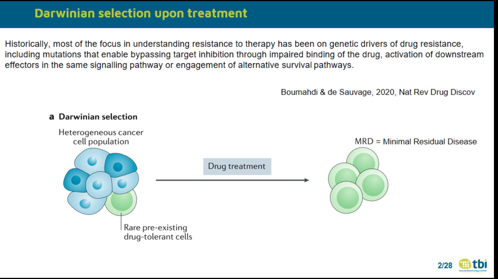
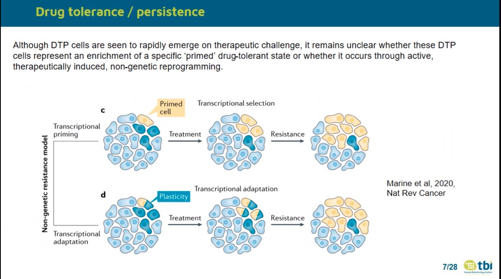
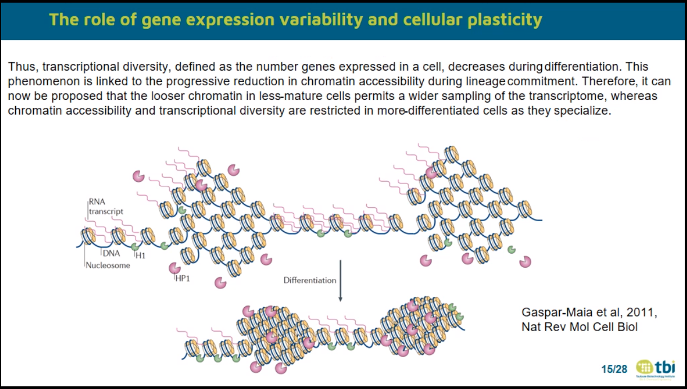
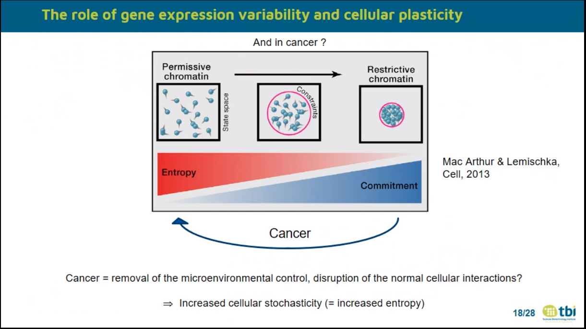
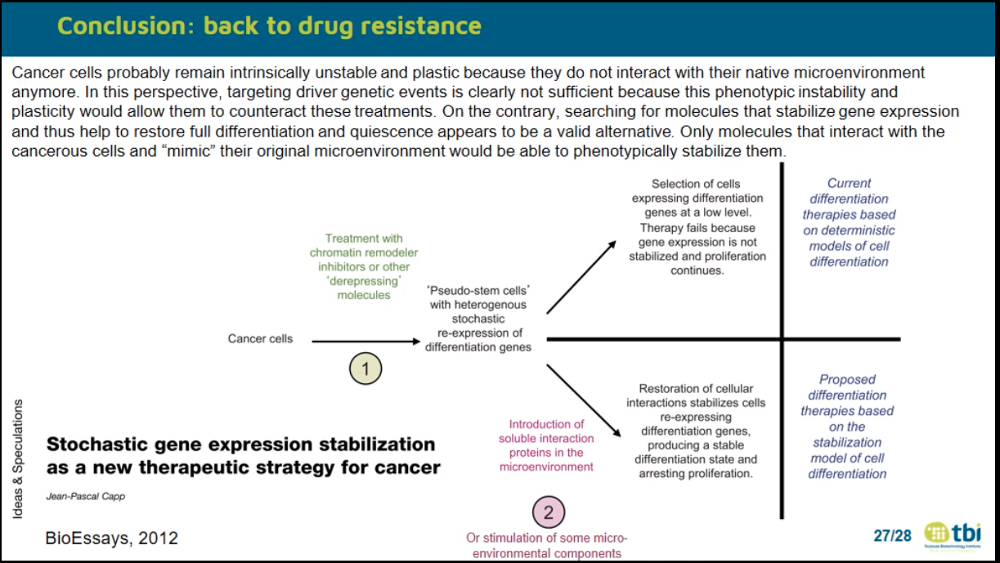

# Cellular plasticity and gene expression variability: from drug tolerance to oncogenesis, and back

Jean-Pascal CAPP, INSA / University of Toulouse

## Abstract

Experimental evidence accumulated over the last years on the importance of phenotypic plasticity and epigenetic adaptability in the emergence of drug-tolerance persister cells. Especially, high levels of gene expression variability (noise) and the associated cellular plasticity are involved in the generation of such cells. Moreover, a global increase in cellular stochasticity (entropy) is observed in cancer cells. It suggests that enhanced random gene expression fluctuations are crucial not only for drug tolerance, but also in oncogenesis. Here their possible origin at the tissue level will be considered from the observation that gene expression variability decreases and that single-cell expression profiles homogenize during differentiation. Indeed, the generation of a differentiated state can be seen as a constrained random process: randomness is provided by the stochastic dynamics of biochemical reactions while the environmental constraints, including cell inner structures and cell-cell interactions, drive the system toward a stabilized state of equilibrium. In that case, oncogenesis would be linked to the removal of this microenvironmental control, i.e. to the disruption of the normal cell-cell interactions. This would produce cells with increased gene expression variability, and initiate oncogenesis. Finally, I will discuss the relationships with the aging process, the example of multiple myeloma and therapeutic implications.

## References:

Capp JP, Thomas F, 2021, Tissue‐disruption‐induced cellular stochasticity and epigenetic drift: Common origins of aging and cancer?, BioEssays, 43:2000140

Capp JP, Bataille R, 2020, Multiple myeloma as a bone disease? The tissue disruption-induced cell stochasticity (TiDiS) theory, Cancers (Basel), 12(8):2158

Capp JP, Laforge B, 2020, A Darwinian and Physical Look at Stem Cell Biology Helps Understanding the Role of Stochasticity in Development, Front Cell Dev Biol, 8:659

Capp JP, 2019, Cancer stem cells: from historical roots to a new perspective. J Oncol, 2019:5189232

Capp JP, Bataille R, 2018, Multiple myeloma exemplifies a model of cancer based on tissue disruption as the initiator event, Front Oncol. 8:355

Capp JP, 2017, Tissue disruption increases stochastic gene expression thus producing tumors: Cancer initiation without driver mutation. Int J Cancer, 140(11):2408-2413

## Notes

Focus on genetic drivers -> mutations alterations

Darwinian selection --> MRD

Pre-existing or acquired?

Hata 2016

Both pre-existing and Late evolution / Genetic assimilation

--> drug-tolerant cellls

Selection of pre-exisitng or de novo mutations

TO READ: **Marine 2020 Nat rev Cancer**

Sharma 2010 Cancer

--> Chromatin-mediated reversible drug tolerant state in Cancer cell subpopulations

Shensi Shen 2020 Cell

Non mutational mechanisms --> role in tumar relapse

Oren Yaara 2021 Nature --> Cycling

Plasticity

Biran B Liau 2017 Cell Stem cell

--> Glioma cell plasticity

Drug tolerant cells?

Shaffer 2017 Nature

Boumahdi & de Sauvage 2020 Nat rev Drug discov

Emert 2021 Nature biotechnology

Hinohara Kunihiko 2018 Cancer cell --> KDM5

Trnascriptional heterogeneity <-> Histone methylation --> Risk of therapeutic resistance

Eduardi A Torre 2021 Nature genetics

**Important role of gene expression variability and cellular plasticity in drug chemoresistance. What about oncogenesis?**

Chang Hannah 2008 Nature

--> Transcritoion noise wont roles lineage

Gulati 2020 Science

--> number expressed genes --> development

MacArthur Ben D. 2013 Cell

"Statistical Mechanics of Pluripotency"

TO READ: **JP Capp 2020 frontiers in Cell and Developmental biology**

Cancer cells go from Commitment to Entropy (in term of Chromatin accessibility)

TO READ: **JP Capp 2017 Int J**

Frequency of cancer stem cells <-> ME

Quintana 2008 Nature
Jeffrey Rosen 2009 The increasing complexity of cancer stem cell paradigm

JP Capp Nouveau regard sur le cancer 2012

JP Capp BioEssays 2012
