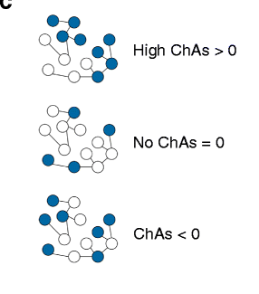
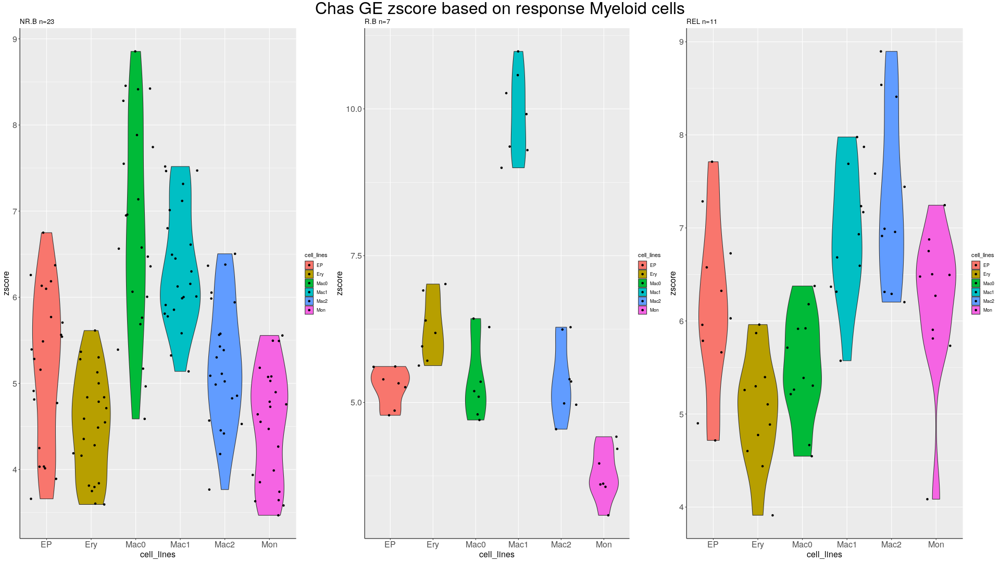
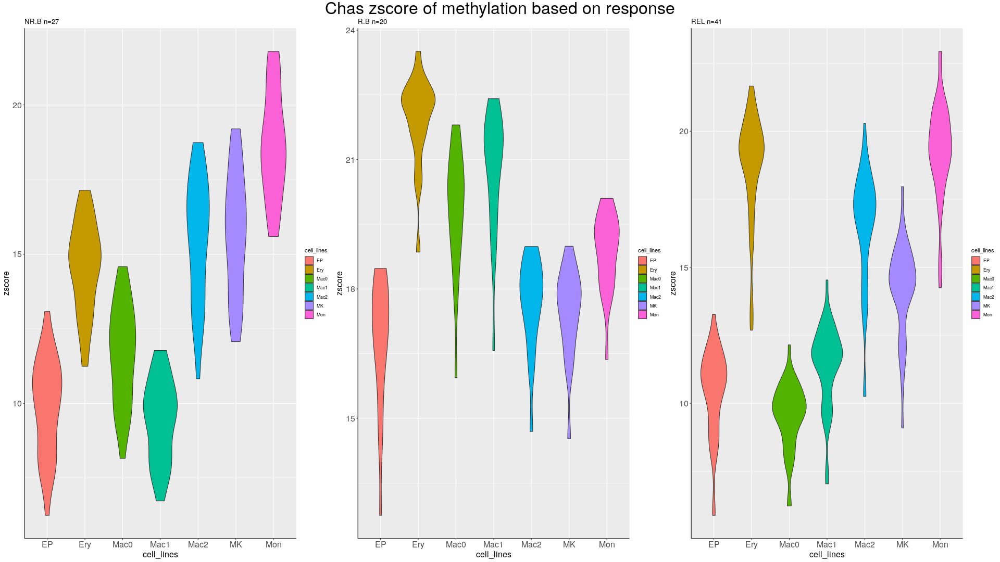

# Week 19 . 09/05 - 13.05

# **TO DO**

* #Audition
* #ARACNe Comparer les réseaux ARACNe
* #Chromatine faire un résumé des résultats, interprétation etc.
* #PPT Préparer pppt pout mercredi
* #GRN

## **ARACNe**

## **Chromatine**

Démarche : L'assortativité est une propriété des réseaux utilisée dans les sciences sociales pour identifier les facteurs expliquant comment les gens établissent des liens sociaux entre eux.

En d'autres termes elle permet de mesurer si des nœuds dans un réseau partagent les mêmes propriétés. Elle reflète le fait que des noeuds interconnectés ont tendance à partager les mêmes propriétés.

Sur la figure précédente, le premier réseau montre une assortativité positive. En effet, les noeuds ayant pour propriété d'être bleus semblent regroupés tandis que les noeuds de propriété blanche le sont entre eux. Le deuxième réseau montre une totale indépendance entre cette propriété et ces interactions. Le troisième réseau avec une assortativité négative montre que les noeuds ayant des propriétés différentes sont plus propices à interagir entre eux.

Dans notre contexte, l'idée est d'identifier des paramètres épigénomiques qui peuvent être associés avec des contacts 3D de la chromatine. Ici, deux paramètres sont analysés : l'expression génique et la méthylation de l'ADN. Toutes deux peuvent être associées à l'environnement 3D de la chromatine contacts avec pour l'expression génique une association avec les promoters et la méthylation directement avec les fragments de la chromatine analysés.

Ici est représenté l'assortativité de l'expression génique avec les contacts 3D de la chromatine de différentes lignée hématopoïétique en fonction des différents phénotypes de réponses à l'iIDHm mais aussi au phénotype de rechute.

On peut ainsi interpréter ses résultats en comparant les lignées les unes avec les autres mais aussi vis à vis des profiles de zscore associés aux phénotypes.

L'assortativité peut aussi être mesurer avec les données de méthylation :

Ici, on peut observer que les
