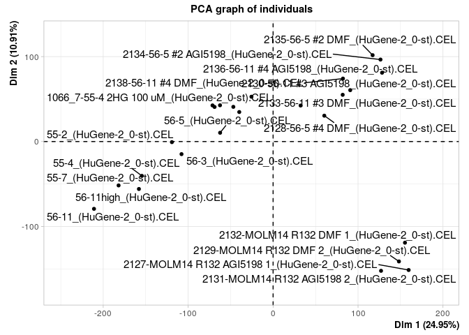
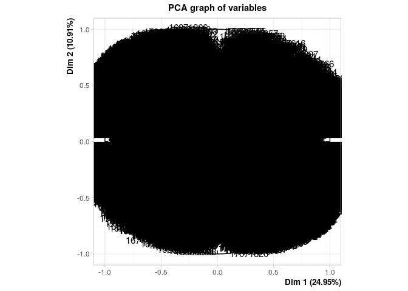
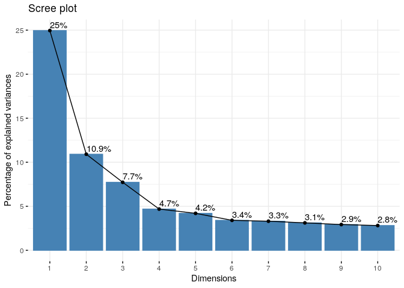
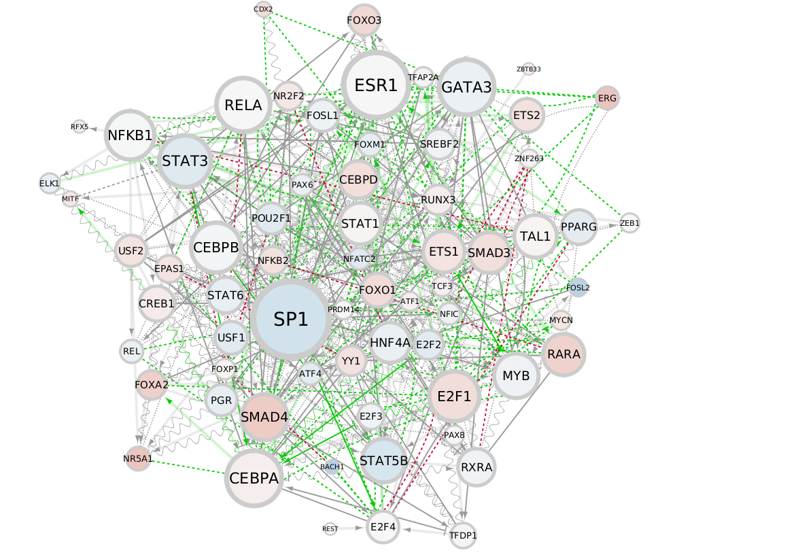
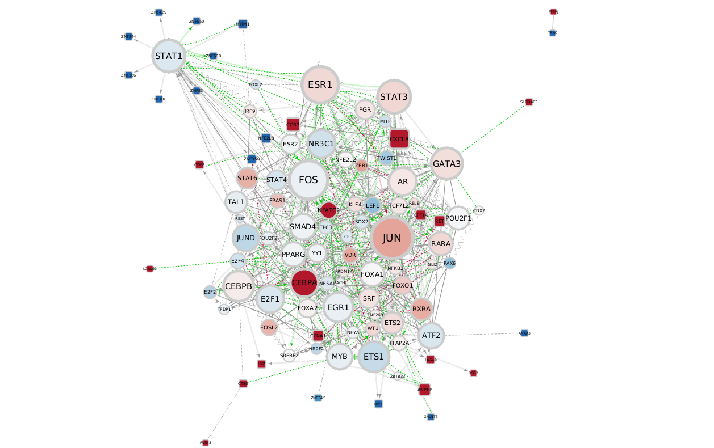
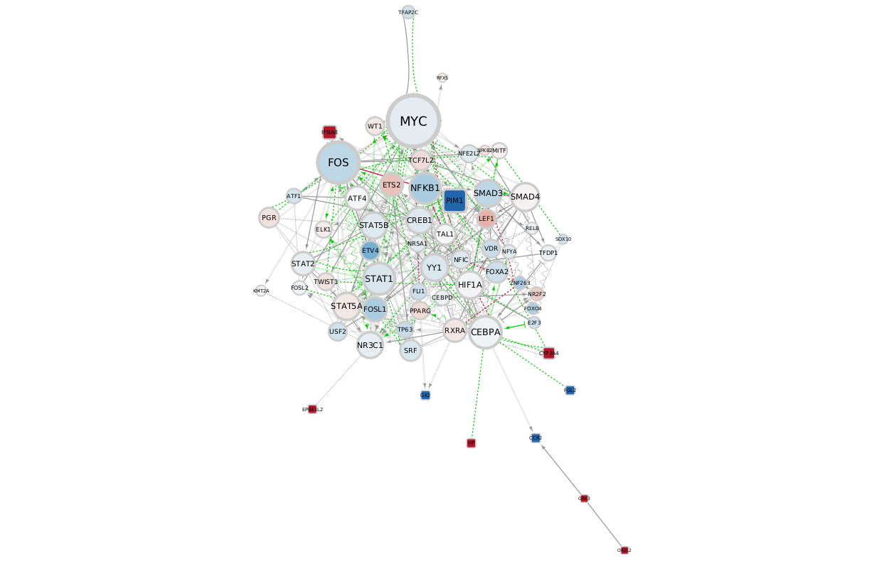

# Analysis of HL60 MOLM14 IDHm cell lines +/- IDHi

# 1. Preparation of transcriptomes

# 2. PCA analysis

    PCA_analysis <- PCA(as.matrix(t(Transcriptomes)), graph = T)

    ## Warning: ggrepel: 6 unlabeled data points (too many overlaps). Consider
    ## increasing max.overlaps

    fviz_eig(PCA_analysis, addlabels = T)

    plot(HL60_Mut_IDHi_vs_no_treat$mrs)

    plot(HL60_Mut_vs_HL60_WT$mrs)

    plot(MOLM14_Mut_IDHi_vs_no_treat$mrs)

# 3. RELA and MYC expression in cell lines

    ID_RELA <- dplyr::filter(Annot, SYMBOL == "RELA") %>% rownames(.)
    ID_MYC <- dplyr::filter(Annot, SYMBOL == "MYC") %>% rownames(.)

    Make_gene_expr_boxplots(Transcriptomes, ID_RELA, "RELA", "HL60.Mut.AGI5198", "HL60_IDHi", "HL60.Mut.DMF", "HL60_DMF", Phenotype)

    Make_gene_expr_boxplots(Transcriptomes, ID_MYC, "MYC", "HL60.Mut.AGI5198", "HL60_IDHi", "HL60.Mut.DMF", "HL60_DMF", Phenotype)

    Make_gene_expr_boxplots(Transcriptomes, ID_RELA, "RELA", "HL60.Mut.None", "HL60_Mut", "HL60.WT.None", "HL60_WT", Phenotype)

    Make_gene_expr_boxplots(Transcriptomes, ID_MYC, "MYC", "HL60.Mut.None", "HL60_Mut", "HL60.WT.None", "HL60_WT", Phenotype)

    Make_gene_expr_boxplots(Transcriptomes, ID_RELA, "RELA", "MOLM14.Mut.AGI5198", "MOLM14_IDHi", "MOLM14.Mut.DMF", "MOLM14_DMF", Phenotype)

    Make_gene_expr_boxplots(Transcriptomes, ID_MYC, "MYC", "MOLM14.Mut.AGI5198", "MOLM14_IDHi", "MOLM14.Mut.DMF", "MOLM14_DMF", Phenotype)

# 4. Network signatures

### HL60 IDHm + IDHi vs HL60 IDHm + DMF

### HL60 IDHm vs HL60 IDHwt

### MOLM14 IDHm + IDHi vs MOLM14 IDHm + DMF

