# Cell symposia CDRC

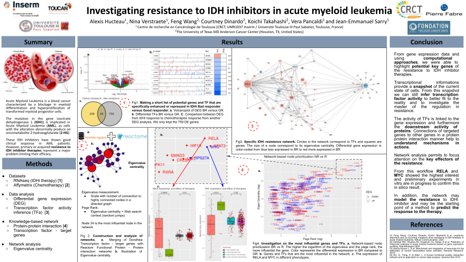

[Link of google slide poster](https://docs.google.com/presentation/d/1SGu41BTUbBmlxsSAGCN7r55c-_qUw5zR97AjK1UJVxc/edit?usp=sharing)

* [Instructions](#instructions)
  * [Summary](#summary)
  * [Online poster](#online-poster)
  * [Poster Number Allocation](#poster-number-allocation)
  * [POSTER PITCH VIDEO](#poster-pitch-video)
  * [Poster production guidelines](#guidelines)
* [The poster](#poster)
  * [Introduction](#introduction)
  * [Conclusion](#conclusion)
  * [Figures](#figures)
* [Poster presentation](#presentation)
* [Potential questions](#potential-questions)

# Instructions {#instructions}

## Summary {#summary}

* 2 minutes video
* Single page poster
* PDF file
* < 5 MB
* Landscape configuration
* in columnsrather than rows
* Introduction upper left
* Conclusion lower right
* Numbered or bulleted lists

## Online poster {#online-poster}

Online posters are to be prepared as a single page PDF file, which is to be uploaded to the online conference
platform. Please ensure that your PDF file is below 5MB. Your invitation to the platform, will be sent closer to
the event.  
To make best use of the screen size, we strongly recommend that this is prepared in a landscape configuration.
A zoom function is available, to assist in your discussions.  
## Poster Number Allocation {#poster-number-allocation}
Each poster will be allocated a poster number (separate from the abstract number you have been assigned) this
will enable you to locate your poster in the online conference programme and direct other delegates to your
poster, via the online chat function.  
Poster presenters are required to be present in their allocated online poster ‘room’, for the session that their
poster is allocated to. Details of your allocated session will be provided in a separate email.
During this presentation time, up to 14 other attendees can enter your poster room, with the video and
microphone of their device enabled, to discuss your poster.  
Full instructions on uploading your poster and using the system are available in the poster upload information
sheet.  
## POSTER PITCH VIDEO: {#poster-pitch-video}
We encourage presenters to include a short poster pitch video for attendees to view, when you are not presenting
your poster live.  
You will then be required to log back into the abstract submission system at
https://app.oxfordabstracts.com/stages/1925/submitter and upload the link there no later than Friday 17th
September.  
If you have any questions about your poster pitch video please email content-esis2021@elsevier.com
GENERAL GUIDELINES FOR POSTER PRODUCTION  
A poster should be self-contained and self-explanatory, allowing different viewers to proceed on their own while
the author is free to supplement or discuss particular points raised in inquiry. Presentations should be kept simple
and clear. A mixture of text and graphics is recommended. Remember that the viewer, not the author, as in the
case of slide presentations, determines the time spent at each poster.  
Poster Layout  
Arrange materials in columns rather than rows. It is easier for viewers to scan a poster by moving along it, rather
than by zigzagging back and forth in front of it. An introduction should be placed at the upper left and a conclusion
at the lower right. The abstract does not need to be presented, as this is available to attendees beforehand in the
conference app.  
Illustrations  
Figures should be clear, visible graphics, with large type. Each figure or table should have a heading of one or two
lines. Additional essential information should be provided below in a legend. Photographs should have good
contrast, sharp focus and, if necessary, an indication of scale.  
Text  
Minimise narrative. Use large type in short, separated paragraphs. Numbered or bulleted lists are effective ways
to convey a series of points. Do not set entire paragraphs in uppercase or boldface type.  
Titles and Fonts  
Titles and captions should be short and easy to read, preferably in a sans serif font. Use large lettering, allowing
attendees to easily read the information presented. Remember to caption your poster with the abstract title,
authors names and affiliations.  

## General guidelines for poster production {#guidelines}

A poster should be self-contained and self-explanatory, allowing different viewers to proceed on their own while
the author is free to supplement or discuss particular points raised in inquiry. Presentations should be kept simple
and clear. A mixture of text and graphics is recommended. Remember that the viewer, not the author, as in the
case of slide presentations, determines the time spent at each poster.  
### Poster Layout
Arrange materials in columnsrather than rows. It is easier for viewers to scan a poster by moving along it, rather
than by zigzagging back and forth in front of it. An introduction should be placed at the upper left and a conclusion
at the lower right. The abstract does not need to be presented, as this is available to attendees beforehand in the
conference app.  
### Illustrations
Figures should be clear, visible graphics, with large type. Each figure or table should have a heading of one or two
lines. Additional essential information should be provided below in a legend. Photographs should have good
contrast, sharp focus and, if necessary, an indication of scale.
### Text
Minimise narrative. Use large type in short, separated paragraphs. Numbered or bulleted lists are effective ways
to convey a series of points. Do not set entire paragraphs in uppercase or boldface type.
### Titles and Fonts
Titles and captions should be short and easy to read, preferably in a sans serif font. Use large lettering, allowing
attendees to easily read the information presented. Remember to caption your poster with the abstract title,
authors names and affiliations.

# The poster {#poster}

## Flash

[Youtube Flash for poster presentation](https://www.youtube.com/watch?v=r1lHdCoC8YA)

## Introduction {#introduction}

Acute Myeloid Leukemia is a blood cancer characterized by a blockage in myeloid differentiation and hyperproliferation of transformed myeloid progenitor cells.   
**The mutation in the gene isocitrate dehydrogenase 1 (IDH1) is implicated in Acute Myeloid Leukemia (AML), as cells with the alteration abnormally produce an oncometabolite 2-hydroxyglutarate (2-HG).**

These IDH inhibitors have shown good clinical response in AML patients. However, **primary or acquired resistance to IDH inhibitor therapies represent a major problem limiting their efficacy.**

**In this study, we analysed RNAseq and affymetrix data from different cohorts of AML patient in an IDHm context** [1][Verhaak][TCGA].

## Methods {#methods}

* Datasets
  * RNAseq (IDHi therapy)
  * Affymetrix (Chemotherapy)
* Raw data analysis
  * Differential gene expression
  * Transcription factor activity inference
* Knowledge-based network
  * Protein-protein interaction
  * Transcription factor - target genes
* Network analysis
  * Eigenvalue centrality

## Conclusion {#conlusion}

From gene expression data and using computational approaches, we were able to highlight potential key genes of the resistance to IDH inhibitor therapies.

Transcriptional informations provide a snapshot of the current state of cells. From this snapshot we can still infer transcription factor activity to better fit to the reality and to investigate the master of the regulation in resistance.

The activity of TFs is linked to the gene expression and furthermore the downstream activity of proteins. Connections of targeted genes to other genes in a protein protein interaction manner help to understand mechanisms in actions.

Network analysis permits to focus attention on the key effectors of the resistance.

From this workflow RELA and MYC showed the highest interest and preliminary experiments in vitro are in progress to confirm this in silico result.

In addition, the network may model the resistance to IDHi inhibitor and may be the starting point of a method to predict the response to the therapy.

## Figures {#figures}

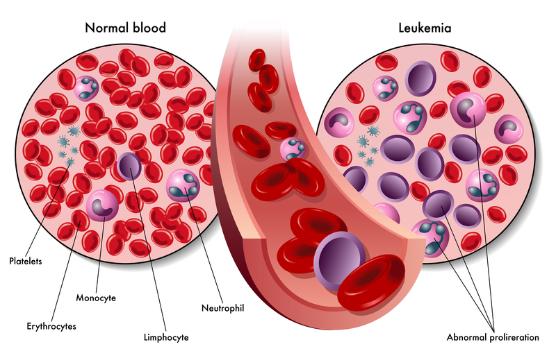

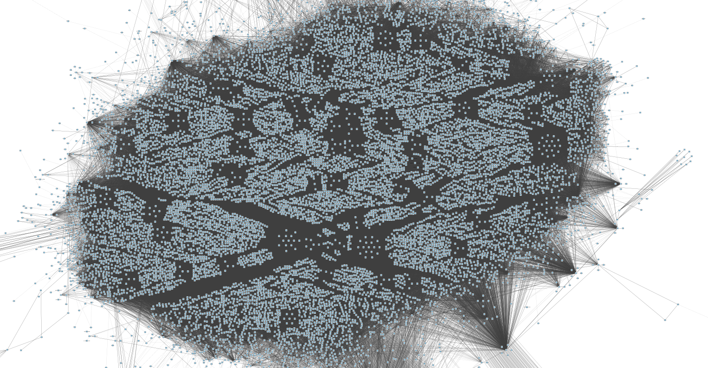

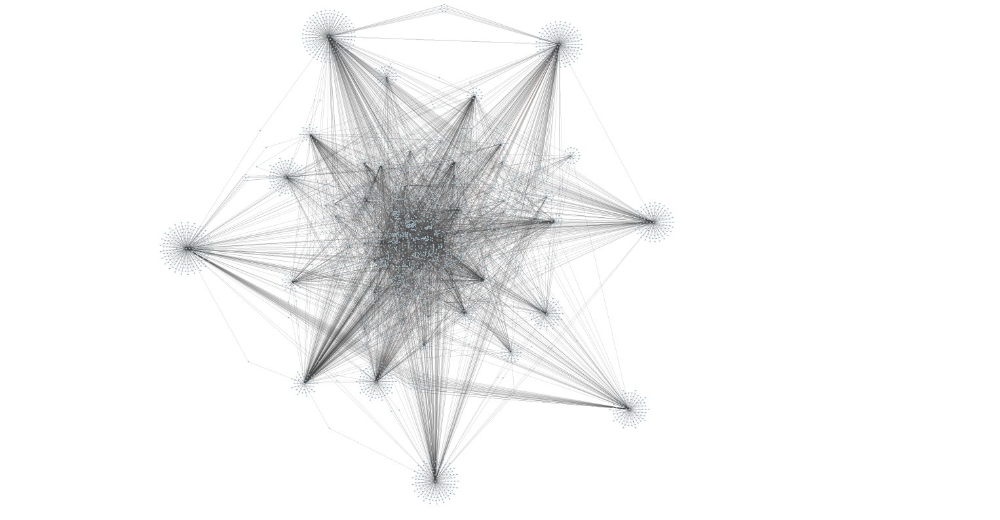

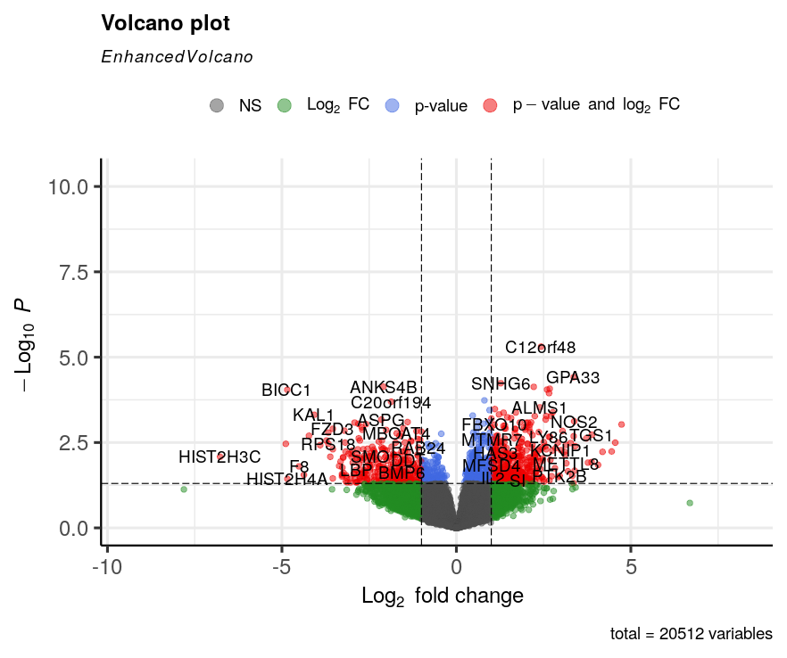

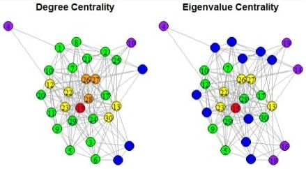

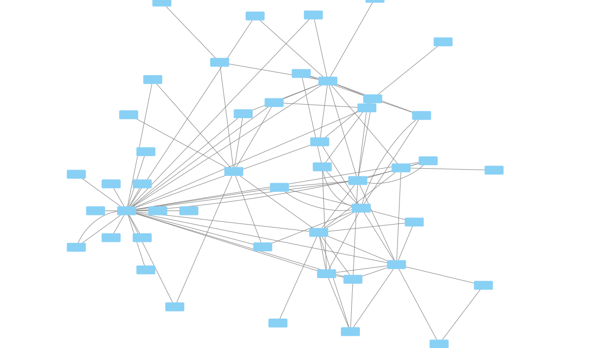

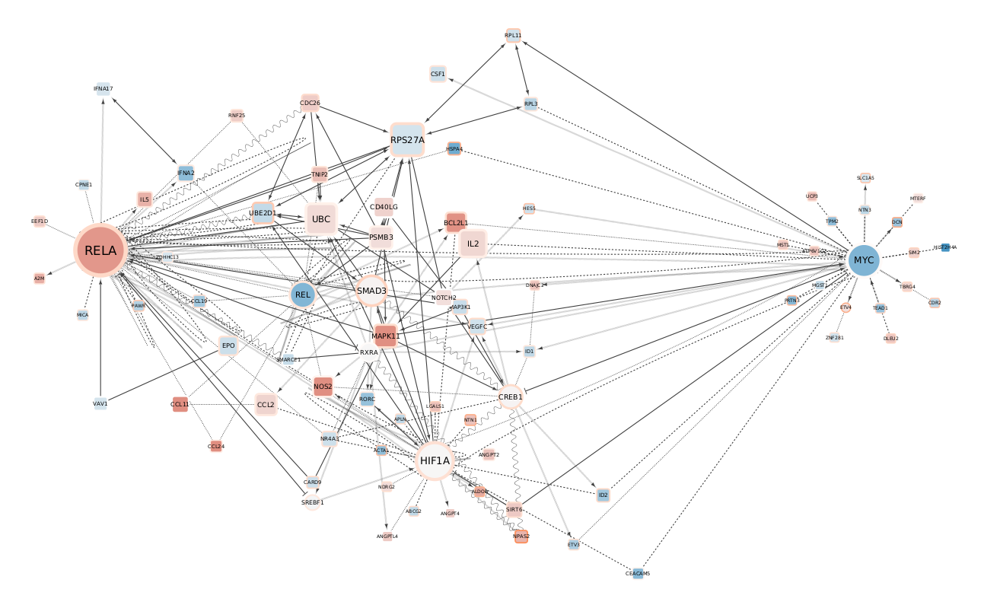

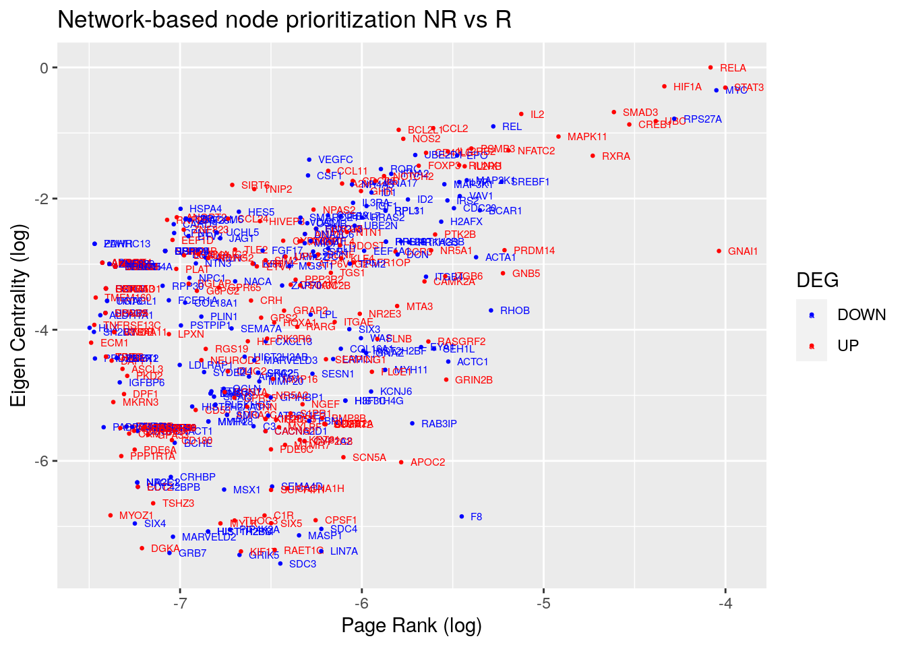

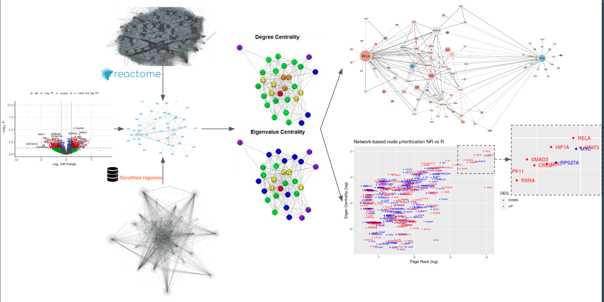

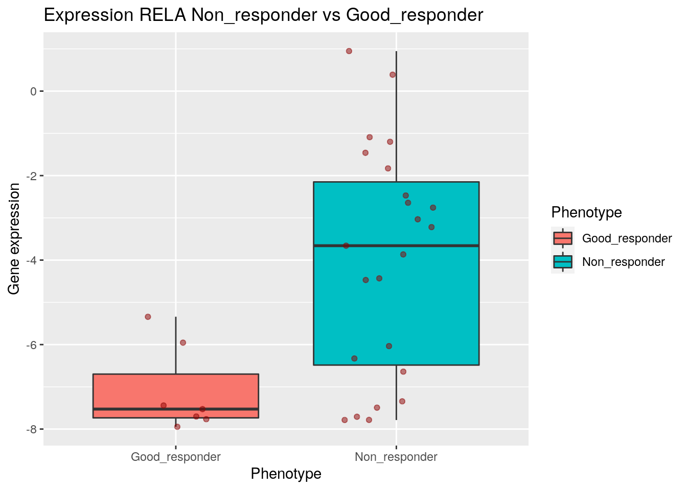

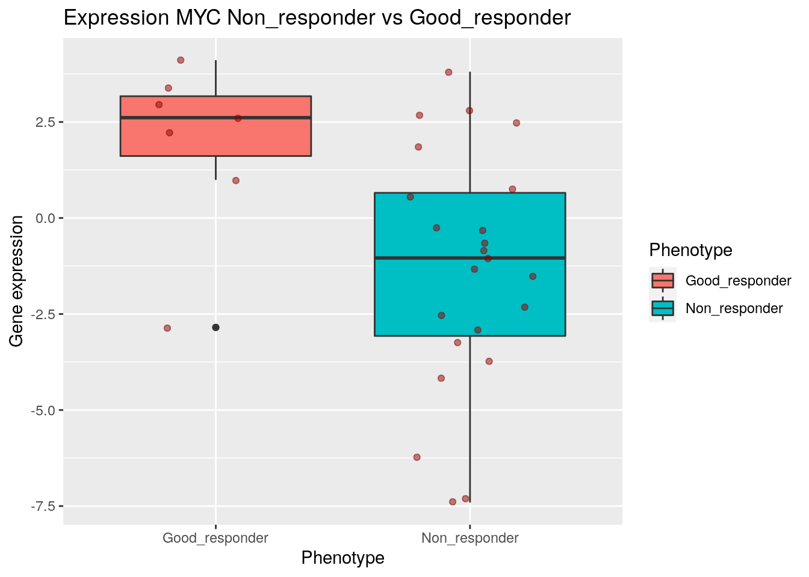

## Poster presentation {#presentation}

So I'm working on Acute myeloid leukemia, a blood cancer and more particularly in the case of IDH mutation. In a few words, the mutation of IDH induces the abnormal production of 2 hydroxyglutarate that causes epigenetic and metabolic changes. Thoses changes give the cancer cells the ability to escape from therapies.  
There is already IDH inhibitor therapies but there is still resistance to therapies. My objective is to investigate this resistance and understand why some patients are good responders and some others are bad responders.  
To proceed, as a computational biologist I analyzed data from RNAseq and affymetrix. Make some differential gene expression analysis and infered the activity of the transcription factor.  
Here, in the first panel, we have some results on it. So some genes are differentially expressed and some tf that are differentially actives. I compared those results with what I found by comparing Good responders to chemotherapies to bad responders in a way to make it specific to IDHi resistance.

I put results into a network that is a combination of a TF - Target gene network called dorothea and a functional protein protein interaction network called Reactome. Then to highlight some genes or tf nodes that are very important in the network, I computed two centrality measurement: the eigenvalue centrality and the page rank. In a few words, those measurement score the nodes depending on the number of connections they have to other nodes scaled by the score of those connected nodes. If a node is connected to a lot of nodes that are themself highly connected, then, the first node has a high score.  

So the network that have been made for the IDHi resistance is in the 3rd panel. The color correspond to the logFC of expression between Bad responders to good responders and the size is the eigenvalue centrality.  
As you can see, the two main nodes are MYC and RELA but we can also highlight TFs like HIF1a, SMAD3, REL or CREB1.

In the last panel is shown the network analysis were genes and TFs are ranked for eigenvalue centrality and page rank. It shows even more the relevance of those TFs in the resistance. You may notice STAT3 but it is also link to chemoresistance so it doesn't appeared into the network.  

Finally, by checking the expression of RELA and MYC through different patients samples and phenotypes, only the IDHi resistance showed a difference in their expression.  

Now we are currently making some in vitro experiments to confirm the results and algorithm of prediction will be made to predict from that, the response of patients to IDHi.  

Feel free to ask questions.

## Potential questions {#potential-questions}

* **About the cohort of patients**

Data came from a study from Koichi and Courtney Dinardo. It's a patient cohort harbouring IDH mutation that received IDHinhibitor treatments. The RNAseq I analysed are at baseline  so it permitted to investigate the inner state that may shift from good responders to bad responders.

* **TF activity**

To predict TF activity, I used an algorithm called VIPER that look at the gene expression of TF target genes to predict their relative activity. For example, the up regulation of a gene A that is known to be activated by a TF B will up level the activity of the TF B.

* **MYC?**

A chromatin alteration of the chromosome 16 leads to the repression MYC by replacing the SWI/SNF TF by RUNX1 on its enhancer.
A SWI/SNF TF called ARID1A is hyper and downregulated in CHolangiocarcinoma IDHm.
There is also a MYC enhancer cluster that regulated normal and leukeamic haematopoietic stem cell hierarchies.

* **RELA**

Also called NF-kB is involved in several cellular functions in hematological malignancies, i.e. inflammation, apoptosis, cell survival, proliferation, angiogenesis, and innate and acquired immunity.
